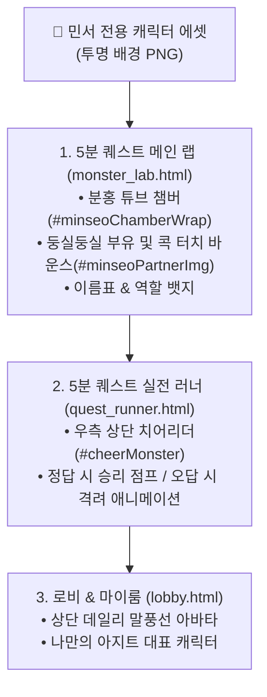

# 🧸 [SSOT] 민서 캐릭터 & 아바타 스튜디오 전담 인계 명세서 (character_studio_handover.md)

> **문서 목적**: 초등학교 1학년 민서의 캐릭터 변경, 신규 파트너 몬스터 추가, 손그림/클레이 누끼 작업, 캐릭터 선택기 등록 작업을 전담하는 대화방을 위한 **단일 원천(SSOT) 인계 가이드**.

---

## 1. 민서 캐릭터가 활약하는 3대 핵심 무대

우리 공부방 시스템에서 민서 캐릭터는 아래 3대 무대에서 실시간으로 렌더링되며 아이와 교감합니다:



---

## 2. 캐릭터 그래픽 및 파일 규격 표준

| 항목 | 표준 규격 | 상세 가이드 |
| :--- | :--- | :--- |
| **파일 포맷** | **PNG (투명 배경 Alpha Channel 필수)** | 흰색/단색 배경이 없어야 튜브나 랩 배경 위에 자연스럽게 얹어짐 |
| **권장 해상도** | **512 x 512 ~ 1024 x 1024 px** | 비율 1:1 또는 캐릭터 외곽에 맞춘 깔끔한 여백 (Crop) |
| **저장 위치** | `kids-school-main/kids/assets/images/characters/` | 영구 보존 작품 미디어는 `kids-archive`에 미러링 |
| **디자인 감성** | **민서 맞춤형 러블리 & 클레이 질감** | 몽글몽글한 찰흙 질감, 파스텔 핑크/화이트/민트 톤, 귀여운 동물/요정/별빛 |

---

## 3. 신규 캐릭터 제작 및 시스템 등록 4단계 파이프라인

새 대화창에서 부모님이 사진을 주시면 아래 4단계를 순서대로 자동 실행합니다:

### [1단계] 소스 수급
* 민서가 스케치북에 직접 그린 손그림 사진
* 아이클레이/찰흙으로 직접 빚은 작품 사진
* AI(제미나이/달리 등)로 생성한 캐릭터 일러스트

### [2단계] 자동 투명 배경(누끼) 및 규격 최적화
* 파이썬 스크립트(`scripts/process_character_png.py`)를 활용하여 배경을 투명하게 제거하고 캐릭터 중심부를 자동 크롭:
  ```python
  # 배경 투명화 및 여백 트리밍
  from PIL import Image
  # rembg 라이브러리 또는 파이썬 알파 마스크 처리
  ```

### [3단계] 에셋 파일 배치
* 공식 경로에 고유 식별자로 저장:
  * 예: `kids/assets/images/characters/minseo_pink_rabbit.png`
  * 예: `kids/assets/images/characters/minseo_star_fairy.png`

### [4단계] 화면 연결 및 렌더러 교체
1. **`monster_lab.html` (메인 랩)**:
   * `#minseoPartnerImg`의 `src` 교체
   * 하단 튜브 안내 배너(`#minseoChamberWrap`)의 이름표 텍스트 업데이트 (예: `"🐰 민서의 핑크 토끼 요정 💖"`)
2. **`quest_runner.html` (러너 치어리더)**:
   * `#cheerMonster`의 민서 전용 이미지 경로 업데이트
3. **캐릭터 선택기(Registry) 확장**:
   * 민서가 기분에 따라 여러 캐릭터 중 하나를 직접 고를 수 있도록 `MINSEO_CHARACTER_PRESETS` 배열에 신규 캐릭터 등록.

---

## 4. 🚪 새 대화창 개설 시 '캐릭터 스튜디오' 전용 인계 프롬프트

새 대화창을 열 때 아래 텍스트를 그대로 복사하여 첫 프롬프트로 입력하면, 새 AI가 즉시 캐릭터 전문 디자이너 겸 엔지니어로 착수합니다:

```markdown
🧸 [민서 캐릭터 & 아바타 스튜디오] 전담 대화창을 시작합니다.
- 사전 필독 문서: kids-school-main/docs/character_studio_handover.md
- 이번 작업 목표: 민서가 요청한 새 캐릭터 제작/교체 및 공부방 화면(5분 퀘스트 랩 & 러너) 연결
- 캐릭터 소재/요청사항: [예: 첨부한 민서 손그림 사진 / 핑크색 아기 고양이 클레이 인형 등]

위 인계 규격에 맞춰 1) 투명 배경(누끼) 정제, 2) 표준 에셋 저장, 3) monster_lab.html 및 quest_runner.html 실시간 교체 및 깃 배포를 진행해줘.
```
