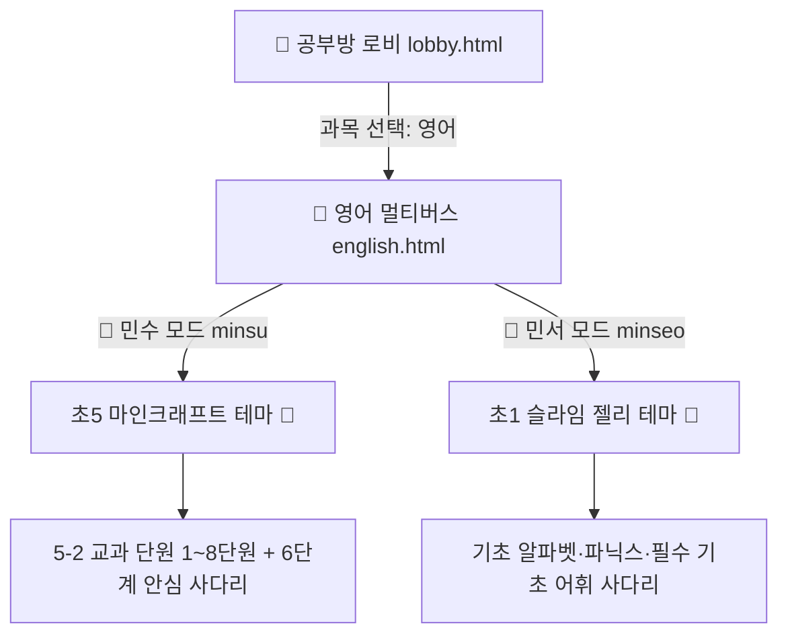
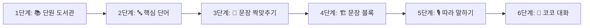
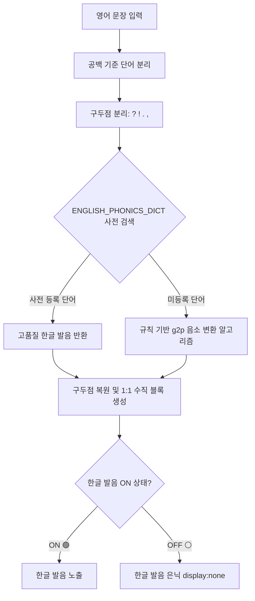
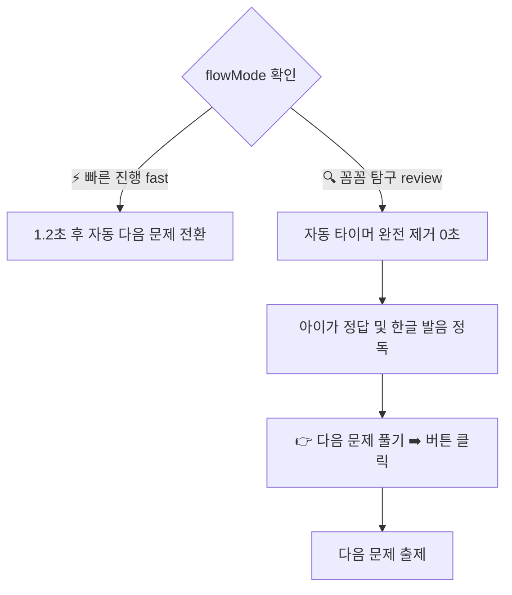

# 🏰 초등 영어 멀티버스 안심 사다리 및 파닉스·발화 템포 통합 명세서 (english_spec.md)

## 1. 개요 및 설계 철학 (Overview & Core Philosophy)
* **문서 목적**: 초등학교 영어 교육과정(초5 천재교육 함순애 교과서 기준 및 초1 기초 파닉스)을 민수의 인지 프로필(`docs/minsu_learning_profile.md`)과 결합하여, 타이핑 스트레스 없이 재미와 성취감으로 완주할 수 있는 **'초등 영어 멀티버스'**(`kids/subjects/english/english.html`)의 프론트엔드·오디오·파닉스·데이터베이스 통합 단일 원천(SSOT) 명세서.
* **핵심 설계 철학**:
  1. **실패 없는 학습 (Errorless Learning & Zero-Typing)**:
     - 철자 직접 타이핑으로 인한 좌절과 거부감을 100% 배제하고, **'3지선다 콕 터치'**와 **'단어 조각 블록 순서 맞추기'** 방식으로 인지 부하를 최소화한다.
     - 오답 선택 시 감점이나 붉은 X 대신 힌트 블록과 함께 재도전 기회를 제공하여 언제나 100% 성공으로 마무리한다.
  2. **파닉스 디딤돌 분리 원칙 (Scaffolding Separation)**:
     - 아직 파닉스 음소 인지가 완성되지 않은 민수를 위해 한글 발음을 지원하되, **출제 중에는 발음을 철저히 숨겨 영어 철자와 소리에 집중**하게 하고, **정답을 맞힌 순간에만 1:1 수직 정렬 블록으로 한글 발음을 노출**하여 성취감과 발음 확인을 동시에 달성한다.
  3. **청각 처리 지연 배려 및 수동 템포 제어권 (Tempo Mastery)**:
     - 일반 음성 속도를 따라가기 힘든 아이를 위해 **원어민 음성 4단계 속도 조절(0.5x 초저속 ~ 1.0x)**을 제공한다.
     - `🔍 꼼꼼 탐구` 모드에서는 자동 넘김 타이머를 일체 제거하고, 아이가 정답 문장을 눈으로 충분히 읽은 뒤 **`[👉 다음 문제 풀기 ➡️]`를 직접 누를 때만 넘어가도록** 완전한 주도권을 보장한다.

---

## 2. 자녀별 맞춤 이원화 프로필 (Dual Profile System)



| 구분 | 👦 민수 (초5) | 👧 민서 (초1) |
| :--- | :--- | :--- |
| **교과 기준** | 2015/2022 개정 초등 5학년 2학기 (천재교육 함순애) | 초등 1학년 기초 파닉스 & 생활 영어 어휘 |
| **실질 인지 수준** | **초등학교 3~4학년 수준 맞춤** (`minsu_learning_profile.md`) | 초등학교 1학년 눈높이 시각/청각 놀이 |
| **UI 테마 & 보상** | 마인크래프트 블록 테마 / 에메랄드·다이아 (`💎`) | 핑크/퍼플 슬라임 테마 / 하리보 젤리 (`🍬`) |
| **주요 학습 모드** | 단어 콕 터치, 문장 조각 블록 빌더, 1:1 한글 발음 디딤돌 | 알파벳 소릿값 매칭, 그림 카드 터치, 챈트 따라하기 |
| **음성 기본 속도** | **0.85x (민수 안심 배속)** | 0.85x 또는 1.0x 표준 배속 |

---

## 3. 6단계 안심 사다리 학습 파이프라인 (6-Stage Learning Ladder)



### 1) 1단계 [워밍업] 📚 단원 동화 도서관 (`openStoryBook`)
- **교재 8컷 대화 스토리북**: 교과서 본문 대화(Listen and Speak, Story Pot 등)를 8컷 삽화와 함께 감상.
- **E-Book 모드**: 책장 넘김 효과, 영문/한글 해석 펼침면 전환, 페이지별 오디오 1:1 싱크.
- **웹툰 모드**: 위아래 스크롤 뷰, 컷별 `[🔊 영어로 듣기]` / `[🇰🇷 우리말로 듣기]` 독립 오디오 버튼 제공.
- **오디오 싱크 가드**: 1장 표지 삽화 로드 시 음성이 중복(2번) 재생되지 않도록 표지/본문 인덱스 오프셋 엄수.

### 2) 2단계 [어휘 빌드업] 🔤 핵심 단어 탐험 (`renderVocaPoolUI`)
- **플래시카드 & 3지선다 터치 퀴즈**: 단어 뜻, 철자, 원어민 발음 듣기.
- **출제 시 발음 은닉**: 문제 풀이 단계에서는 한글 발음을 감추고 소리와 철자 연결에 집중.

### 3) 3단계 [구조 이해] 🧩 문장 짝 맞추기 (`renderStage3UI`)
- 영어 문장과 우리말 해석 카드를 터치하여 1:1로 짝을 짓는 카드 매칭 인터랙션.

### 4) 4단계 [실전 딥 다이브] 🏗️ 문장 블록 빌더 (`renderStage4UI`)
- **단어 조각 배열 & 빈칸 완성**: 문장 구조(주어+과거동사+목적어 등)를 조각 블록 터치로 순서대로 완성.
- **출제 중 발음 은닉**: 단어 조각 풀(`sent-word-pool`), 객관식 선택지(`choices`), 빈칸 슬롯(`sent-word-blanks`) 모두 한글 발음 표시 금지.
- **정답 성공 카드 (`renderStage4SuccessCard`)**:
  - 문장 조각을 맞추는 순간 축하 이펙트와 함께 정답 성공 카드 노출.
  - **영단어 하단 1:1 수직 정렬 블록**으로 한글 발음 노출 (`renderSentencePhonicsHtml`).
  - 정답 카드 상단에 **`[🗣️ 한글 발음 ON 🟢 / OFF ⚪]` 토글 버튼** 상시 배치.
  - **템포 컨트롤러 준수**: `🔍 꼼꼼 탐구` 모드에서는 15초 자동 타이머 완전 제거 ➔ `[👉 다음 문제 풀기 ➡️]` 클릭 시에만 전환.

### 5) 5단계 [발화 훈련] 🎙️ 원어민 따라 말하기 (`renderStage5UI`)
- 원어민(Jenny Neural) 문장 음성을 듣고 큰 소리로 따라 말하기.
- 4단계 속도 조절기로 천천히(0.5x) 발음의 디테일을 듣고 따라 하는 안심 훈련.

### 6) 6단계 [실전 응용] 💬 요정 코코와 실전 대화 (`renderStage6UI`)
- 교과서 주요 표현(예: 7단원 *"What did you do last weekend?" ➔ "I visited my grandpa."*)을 상황에 맞게 묻고 답하는 롤플레잉.

### 🖨️ 특별 지원: 학습지 인쇄실
- **4선지 줄공책 인쇄실 (`print_notebook.html`)**: 초등 4선지 규격에 맞춘 알파벳/단어 쓰기 연습지.
- **단원 보카 미니북 인쇄실 (`print_minibook.html`)**: 단원별 핵심 단어/문장을 손바닥 크기 미니북으로 인쇄.

---

## 4. 파닉스 한글 발음 디딤돌 아키텍처 (Phonics Scaffolding Engine)



### 1) 1:1 수직 정렬 렌더링 규격 (`renderSentencePhonicsHtml`)
```html
<div class="phonics-sentence-box">
  <div class="phonics-word-unit">
    <span class="p-eng">What</span>
    <span class="p-kor">왓</span>
  </div>
  <div class="phonics-word-unit">
    <span class="p-eng">did</span>
    <span class="p-kor">디드</span>
  </div>
  <div class="phonics-word-unit">
    <span class="p-eng">you</span>
    <span class="p-kor">유</span>
  </div>
  <div class="phonics-word-unit">
    <span class="p-eng">do?</span>
    <span class="p-kor">두?</span>
  </div>
</div>
```

### 2) CSS 스타일 가이드
- `.phonics-sentence-box`: `display: flex; flex-wrap: wrap; gap: 8px 12px; justify-content: center;`
- `.phonics-word-unit`: `display: inline-flex; flex-direction: column; align-items: center;`
- `.p-eng`: `font-size: 1.25rem; font-weight: 700; color: #1e293b;`
- `.p-kor`: `font-size: 0.85rem; font-weight: 600; color: #6366f1; background: #e0e7ff; padding: 1px 6px; border-radius: 4px; margin-top: 3px;`
- `.hide-phonics .p-kor`: `display: none !important;`

### 3) 사전(`ENGLISH_PHONICS_DICT`) 및 g2p 폴백 체계
- **내장 사전 (`ENGLISH_PHONICS_DICT`)**: 초등 5학년 1~8단원 핵심 단어 및 빈출 표현(의문사, 조동사, 과거동사 등 500개 이상) 100% 매핑.
  - 예: `what ➔ 왓`, `did ➔ 디드`, `last ➔ 라스트`, `weekend ➔ 위켄드`, `visited ➔ 비지티드`, `grandpa ➔ 그랜파`.
- **규칙 기반 g2p 알고리즘 (`transcribeEnglishToKoreanPhonics`)**:
  - 사전에 없는 신규 단어가 들어올 경우 자음/모음 음소 분해 규칙을 통해 자연스러운 한국어 표기 자동 합성.

### 4) 토글 상태 영구 보존 API
- `isEnglishPhonicsEnabled()`: `localStorage.getItem('english_phonics_visible') !== 'off'` (기본값 `true/ON`).
- `setEnglishPhonicsEnabled(enabled)`: 스토리지 저장 및 화면 내 모든 `.phonics-toggle-btn`, `.p-kor`, `.phonics-sentence-box` 실시간 갱신.
- `toggleEnglishPhonics()`: 상태 반전 및 UI 동기화.

---

## 5. 원어민 Edge-TTS 오디오 및 발화 속도 제어 파이프라인

### 1) 오디오 엔진 및 음성 표준
- **엔진**: Microsoft Edge Neural TTS (Cloudflare Worker `/api/tts` 스트리밍).
- **영어 보이스**: **`en-US-JennyNeural`** (자연스럽고 또렷한 미국식 여성 원어민 음성).
- **한국어 해설/요정 보이스**: **`ko-KR-SunHiNeural`** (`speakFairyTTS`).

### 2) 4단계 발화 속도 표준 (`localStorage('english_speech_rate')`)
```html
<div class="speech-speed-selector">
  <button class="speed-btn" onclick="setSpeechSpeed(0.5)">0.5x 초저속</button>
  <button class="speed-btn" onclick="setSpeechSpeed(0.7)">0.7x 저속</button>
  <button class="speed-btn active" onclick="setSpeechSpeed(0.85)">0.85x 보통(민수안심)</button>
  <button class="speed-btn" onclick="setSpeechSpeed(1.0)">1.0x 표준</button>
</div>
```
- **기본 속도**: **`0.85x`** (민수의 청각 인지 속도에 최적화된 안심 배속).
- **초저속 `0.5x`**: 발음이 뭉개지거나 빠른 복합단어(예: *basketball, visited*)를 낱낱이 분해해서 들을 때 사용.
- **오디오 재생 시 적용**: `audioEl.playbackRate = currentSpeed;`.

---

## 6. 전 과목 공통 템포 컨트롤러 (`quiz-flow-controller.js`) 연동



- **Local-First SWR 원칙**: 화면 진입 시 로컬 스토리지에서 0초 즉시 로드 후 백그라운드에서 노션 INVENTORY DB의 `학습설정` 속성과 동기화.
- **영어방 수동 제어 엄수**: `flowMode === 'review'`일 때 어떠한 `setTimeout` 자동 전환도 허용하지 않으며, 오직 사용자의 명시적인 버튼 클릭 이벤트로만 다음 단계로 전환한다.

---

## 7. 노션 VOCA DB 연동 규격 (Notion Database Specification)

* **데이터베이스 ID**: `375a27115b6880ea89cff00dc6b694be` (VOCA DB)
* **주요 필드 매핑**:
  - `단어` (title): 영문 단어/문장 (예: *"What did you do last weekend?"*)
  - `뜻` (rich_text): 한국어 뜻 (예: *"지난 주말에 뭐 했니?"*)
  - `과목` (select): `영어`
  - `학생` (select): `민수` / `민서`
  - `학년-학기` (select): `5-2` / `1-2`
  - `단원` (select): `7단원` (예: *"7. What Did You Do Yesterday?"*)
  - `카테고리` (select): `핵심문장` / `핵심어휘`
  - `음성파일명` (rich_text): Edge-TTS 생성 파일명 매핑

### 7단원(What Did You Do Yesterday?) 핵심 문장 17선 SSOT:
1. `What did you do last summer?` (지난여름에 뭐 했니?)
2. `What did you do last weekend?` (지난 주말에 뭐 했니?)
3. `What did you do yesterday?` (어제 뭐 했니?)
4. `What did you do there?` (거기서 뭐 했니?)
5. `I ate chicken.` (치킨을 먹었어.)
6. `I made a car.` (자동차를 만들었어.)
7. `I played basketball.` (농구를 했어.)
8. `I took many pictures.` (사진을 많이 찍었어.)
9. `I visited my grandpa.` (할아버지를 방문했어.)
10. `I watched a movie.` (영화를 봤어.)
11. `I saw him.` (그를 봤어.)
12. `I cleaned my room.` (내 방을 청소했어.)
13. `I went camping.` (캠핑을 갔어.)
14. `How was it?` (어땠니?)
15. `It was fun.` (재미있었어.)
16. `It was hard.` (힘들었어.)
17. `It was boring.` (지루했어.)

---

## 8. 보상 및 시간표 부스트 규칙 (Rewards & Timetable Boost)
1. **문제 풀이 실시간 보상**: 정답 2문제마다 실시간 +1💎/🍬 즉시 지급.
2. **10문제 완주 보너스**: 10문제 전량 완주 시 +5💎/🍬 (예습 부스트 시 +7💎/🍬).
3. **시간표 부스트 연동 (`timetable-boost.js`)**:
   - **오늘 복습 과목**: 일일 보상 획득 상한 100개 ➔ **150개 확장**, 경험치 **1.2배** 가산.
   - **내일 예습 과목**: 10문제 완주 보너스 기본 +5 ➔ **+7개** 지급.
4. **학습일지 자동 기록**: 1세션 완료 시 노션 학습일지 DB(`37aa2711...`)에 정답률, 문제 수, 소요 시간을 안전 전송 (`isLogged` 락 및 `pagehide` 이탈 가드 적용).
