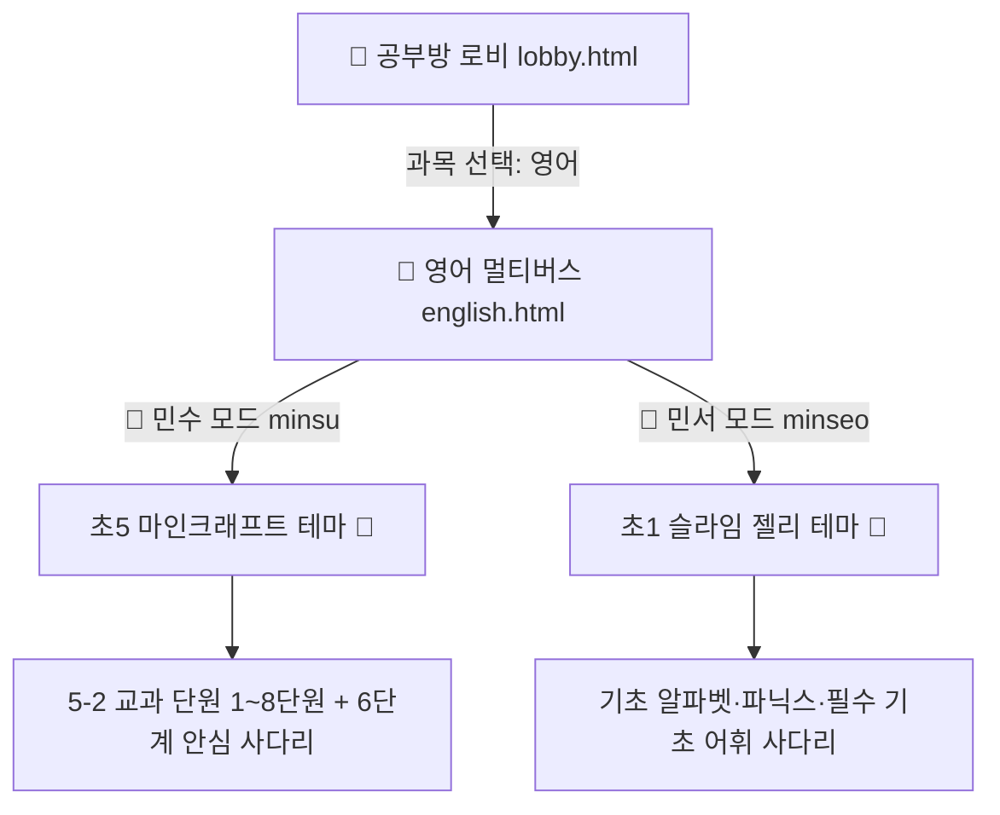
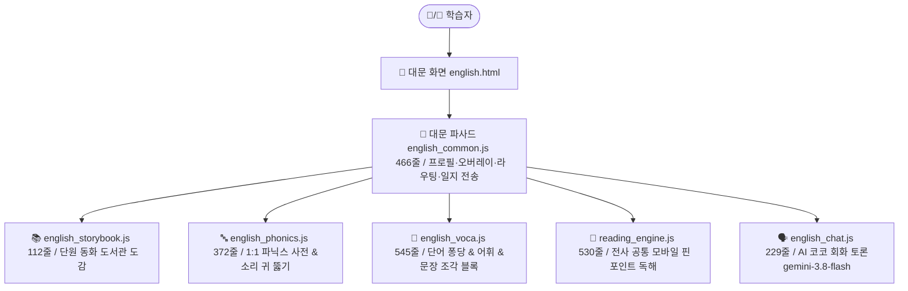
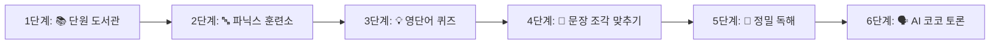
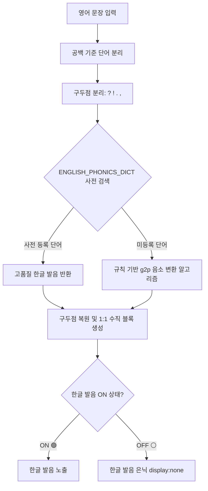
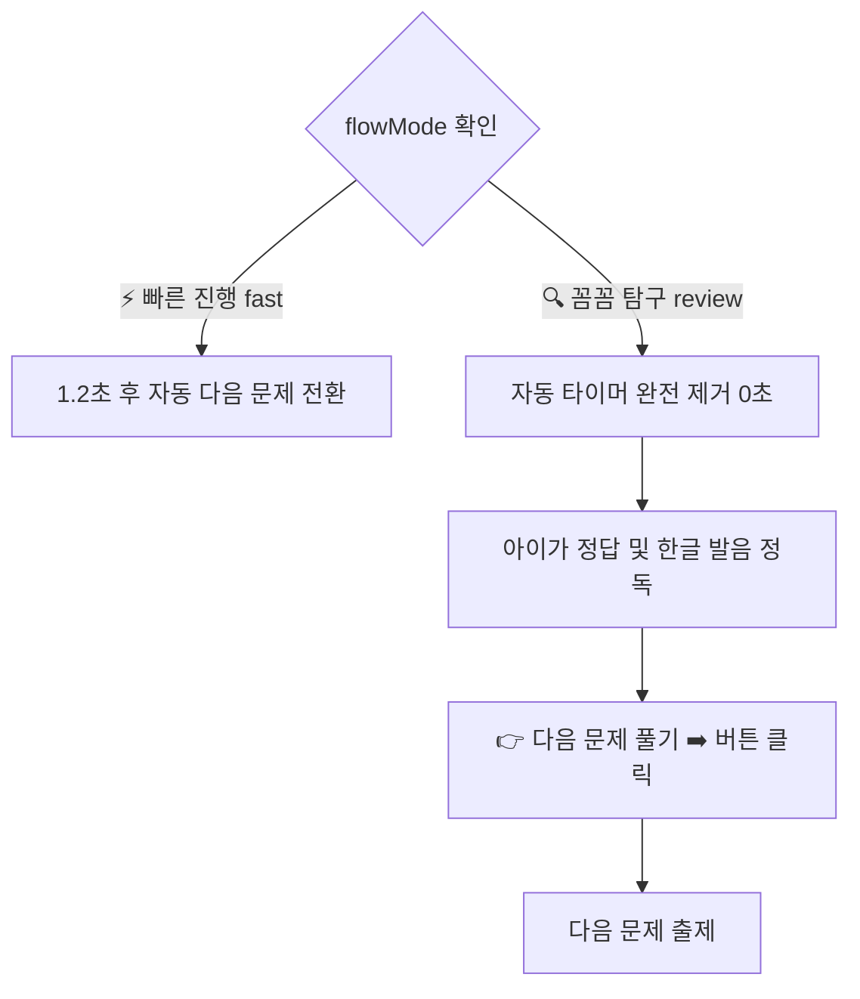

# 🏰 초등 영어 멀티버스 안심 사다리 및 파닉스·발화 템포 통합 명세서 (english_spec.md)

## 1. 개요 및 설계 철학 (Overview & Core Philosophy)
* **문서 목적**: 초등학교 영어 교육과정(초5 천재교육 함순애 교과서 기준 및 초1 기초 파닉스)을 민수의 인지 프로필(`docs/minsu_learning_profile.md`)과 결합하여, 타이핑 스트레스 없이 재미와 성취감으로 완주할 수 있는 **'초등 영어 멀티버스'**(`kids/subjects/english/english.html`)의 프론트엔드·오디오·파닉스·데이터베이스 통합 단일 원천(SSOT) 명세서.
* **핵심 설계 철학**:
  1. **실패 없는 학습 (Errorless Learning & Zero-Typing)**:
     - 철자 직접 타이핑으로 인한 좌절과 거부감을 100% 배제하고, **'3지선다 콕 터치'**와 **'단어 조각 블록 순서 맞추기'** 방식으로 인지 부하를 최소화한다.
     - 오답 선택 시 감점이나 붉은 X 대신 힌트 블록과 함께 재도전 기회를 제공하여 언제나 100% 성공으로 마무리한다.
  2. **파닉스 디딤돌 분리 원칙 (Scaffolding Separation)**:
     - 아직 파닉스 음소 인지가 완성되지 않은 민수를 위해 한글 발음을 지원하되, **출제 중에는 발음을 철저히 숨겨 영어 철자와 소리에 집중**하게 하고, **정답을 맞힌 순간에만 1:1 수직 정렬 블록으로 한글 발음을 노출**하여 성취감과 발음 확인을 동시에 달성한다.
  3. **청각 처리 지연 배려 및 수동 템포 제어권 (Tempo Mastery)**:
     - 일반 음성 속도를 따라가기 힘든 아이를 위해 **원어민 음성 4단계 속도 조절(0.5x 초저속 ~ 1.0x)**을 제공한다.
     - `🔍 꼼꼼 탐구` 모드에서는 자동 넘김 타이머를 일체 제거하고, 아이가 정답 문장을 눈으로 충분히 읽은 뒤 **`[👉 다음 문제 풀기 ➡️]`를 직접 누를 때만 넘어가도록** 완전한 주도권을 보장한다.

---

## 2. 자녀별 맞춤 이원화 프로필 (Dual Profile System)


```mermaid
graph TD
    Lobby[🏰 공부방 로비 lobby.html] -->|과목 선택: 영어| EnglishRoom[🏰 영어 멀티버스 english.html]
    
    EnglishRoom -->|👦 민수 모드 minsu| MinsuTrack[초5 마인크래프트 테마 💎]
    EnglishRoom -->|👧 민서 모드 minseo| MinseoTrack[초1 슬라임 젤리 테마 🍬]
    
    MinsuTrack --> MinsuLadder[5-2 교과 단원 1~8단원 + 6단계 안심 사다리]
    MinseoTrack --> MinseoLadder[기초 알파벳·파닉스·필수 기초 어휘 사다리]
```

| 구분 | 👦 민수 (초5) | 👧 민서 (초1) |
| :--- | :--- | :--- |
| **교과 기준** | 2015/2022 개정 초등 5학년 2학기 (천재교육 함순애) | 초등 1학년 기초 파닉스 & 생활 영어 어휘 |
| **실질 인지 수준** | **초등학교 3~4학년 수준 맞춤** (`minsu_learning_profile.md`) | 초등학교 1학년 눈높이 시각/청각 놀이 |
| **UI 테마 & 보상** | 마인크래프트 블록 테마 / 에메랄드·다이아 (`💎`) | 핑크/퍼플 슬라임 테마 / 하리보 젤리 (`🍬`) |
| **주요 학습 모드** | 단어 콕 터치, 문장 조각 블록 빌더, 1:1 한글 발음 디딤돌 | 알파벳 소릿값 매칭, 그림 카드 터치, 챈트 따라하기 |
| **음성 기본 속도** | **0.85x (민수 안심 배속)** | 0.85x 또는 1.0x 표준 배속 |

---

## 2-1. 🏰 영어 멀티버스 골디락스 모듈화 아키텍처 (Goldilocks Modular Architecture)

전사 최고 거버넌스 헌법(규칙 7조: 골디락스 적정 응집도 300~600줄, 절대 상한 800줄 미만)에 의거하여, 기존 2,154줄의 비대했던 `english_common.js`를 **1개의 초경량 대문 파사드와 4개의 전문 서브모듈**로 완전 분리 구축하였습니다.


```mermaid
graph TD
    User([👦/👧 학습자]) --> EnglishHTML[🏰 대문 화면 english.html]
    EnglishHTML --> EnglishFacade[🏰 대문 파사드 english_common.js <br> 466줄 / 프로필·오버레이·라우팅·일지 전송]
    
    EnglishFacade --> S1[📚 english_storybook.js <br> 112줄 / 단원 동화 도서관 도감]
    EnglishFacade --> S2[🔤 english_phonics.js <br> 372줄 / 1:1 파닉스 사전 & 소리 귀 뚫기]
    EnglishFacade --> S3[🧩 english_voca.js <br> 545줄 / 단어 퐁당 & 어휘 & 문장 조각 블록]
    EnglishFacade --> S4[📖 reading_engine.js <br> 530줄 / 전사 공통 모바일 핀포인트 독해]
    EnglishFacade --> S5[🗣️ english_chat.js <br> 229줄 / AI 코코 회화 토론 gemini-3.8-flash]
```

| 모듈 경로 | 역할 및 책임 | 라인 수 | 네임스페이스 |
| :--- | :--- | :---: | :--- |
| **`kids/js/english_common.js`** | 🏰 대문 파사드 (프로필 초기화, 오버레이 제어, 데이터 페칭, 학년/단원 필터링, 완료 학습일지 전송, 4선지 인쇄실) | 466줄 | `window.EnglishCommon` |
| **`kids/js/english_storybook.js`** | 📚 [1단계] 스토리북 서가 도감 모듈 (단원별 동화 목록, 모달 렌더링, e-Book/웹툰 뷰어 연동) | 112줄 | `window.EnglishStorybook` |
| **`kids/js/english_phonics.js`** | 🔤 [1단계 알파벳 & 3단계 파닉스] 발음 디딤돌 엔진 (1:1 파닉스 사전, Jenny Neural TTS 음성, [1단계] 알파벳 터치방, [3단계] 소리 귀 뚫기) | 372줄 | `window.EnglishPhonics` |
| **`kids/js/english_voca.js`** | 🧩 [2·3·4단계] 어휘·문장 훈련소 ([2단계] 3지선다 퐁당, [3단계] 4종 어휘/슬라임 자석, [4단계] 문장 블록 빌더 & 성공 카드) | 545줄 | `window.EnglishVoca` |
| **`kids/js/english_chat.js`** | 🗣️ [6단계] AI 코코 회화 토론 모듈 (지문별 롤플레잉, 생각 확장 대화, 2026 플래그십 `gemini-3.8-flash` 적용, 부모 검수 뱃지) | 229줄 | `window.EnglishChat` |

---

## 3. 6단계 안심 사다리 학습 파이프라인 (6-Stage Learning Ladder)


```mermaid
flowchart LR
    S1[1단계: 📚 단원 도서관] --> S2[2단계: 🔤 파닉스 훈련소]
    S2 --> S3[3단계: 💡 영단어 퀴즈]
    S3 --> S4[4단계: 🧩 문장 조각 맞추기]
    S4 --> S5[5단계: 📖 정밀 독해]
    S5 --> S6[6단계: 🗣️ AI 코코 토론]
```

### 1) 1단계 [원서 친숙해지기] 📚 단원 동화 도서관 (`openStoryBook` / `EnglishStorybook`)
- **서가 구축 목록 (단원별 E-Book/웹툰 하이브리드 도서관)**:
  - 🏠 **9단원 (L9)**: `Welcome to My Dream House!` (어서 와, 나의 꿈의 집으로! · 집과 방의 물건 소개하기)
  - 🔍 **8단원 (L8)**: `The Great Festival Mission` (위대한 축제 미션 · 외모와 옷차림 묻고 답하기)
  - ⛺ **7단원 (L7)**: `Minsu and Junwoo's Weekend` (민수와 준우의 즐거운 주말 · 지난 일 묻고 답하기)
  - 🧭 **11단원 (L11)**: `Minsu Explores the Village` (민수의 신나는 마을 탐험 · 위치 묻고 길 안내하기)
- **교재 8~10컷 일러스트 스토리북**: 교과서 본문 대화와 핵심 어휘를 담은 고화질 삽화와 함께 감상.
- **E-Book 모드**: 책장 넘김 효과, 영문/한글 해석 펼침면 전환, 페이지별 오디오 1:1 싱크.
- **웹툰 모드**: 위아래 스크롤 뷰, 컷별 `[🇺🇸 영어 듣기]` / `[🇰🇷 한국어]` 독립 오디오 버튼 제공.
- **오디오 싱크 가드**: 1장 표지 삽화 로드 시 음성이 중복(2번) 재생되지 않도록 표지/본문 인덱스 오프셋 엄수.

### 2) 2단계 [귀 뚫기 디딤돌] 🔤 파닉스 훈련소 (`EnglishPhonics`)
- **음가 학습 & 슬라임 알파벳 자석판**: 알파벳 음가 훈련, 소리 듣고 3지선다 콕 터치.
- **출제 시 발음 은닉**: 문제 풀이 단계에서는 한글 발음을 감추고 소리와 철자 연결에 집중.

### 3) 3단계 [어휘 빌드업] 💡 영단어 핵심 정복 (`EnglishVoca`)
- **4종 모드**: 보고 따라 적기(`copy`), 한글 ➔ 영어(`toEnglish`), 영어 ➔ 한글(`toKorean`), 듣고 적기(`listening`).
- **슬라임 철자 자석판 셔플**: 초성 힌트와 슬라임 자석판을 통한 에러리스 자기주도 어휘 정복.

### 4) 4단계 [실전 딥 다이브] 🧩 문장 조각 맞추기 (`renderSentenceQuizUI`)
- **단어 조각 배열 & 빈칸 완성**: 문장 구조(주어+동사+목적어 등)를 조각 블록 터치로 순서대로 완성.
- **정답 성공 카드 (`renderStage4SuccessCard`)**:
  - 문장 조각을 맞추는 순간 축하 이펙트와 함께 정답 성공 카드 노출.
  - **영단어 하단 1:1 수직 정렬 블록**으로 한글 발음 노출 (`renderSentencePhonicsHtml`).
  - 정답 카드 상단에 **`[🗣️ 한글 발음 ON 🟢 / OFF ⚪]` 토글 버튼** 상시 배치.

### 5) 5단계 [문맥 문해력] 📖 정밀 독해 트레이닝 (`kids/core/reading_engine.js`)
- **공부방 표준 학년 선택 바 (`reading-grade-bar`)**: `5-1` (1~6단원), `5-2` (7단원 이후), `전체보기` 단일 표준 칩 지원.
- **단원별 그룹화 서가 (`reading-unit-section`)**: 1단원, 2단원... 단원별 헤더 아래 지문 카드 가지런히 정돈.
- **모바일 핀포인트 독해**: 스크롤 피로 없는 1문항 슬라이스 카드 + 💡 [결정적 단서] 접이식 단락 힌트 토글 + 📜 지문 전문 바텀시트.

### 6) 6단계 [실전 응용 & 심화] 🗣️ AI 요정 회화 토론 (`EnglishChat`)
- **2026 플래그십 표준**: `gemini-3.8-flash` 기반 상황별 롤플레잉 및 지문 심층 토론.
- **생각 확장 코칭**: 요정 코코와 배운 표현을 응용하여 자유롭게 대화하고 부모 검수 뱃지 획득.

### 🖨️ 특별 지원: 학습지 인쇄실
- **4선지 줄공책 인쇄실 (`print_notebook.html`)**: 초등 4선지 규격에 맞춘 알파벳/단어 쓰기 연습지.
- **단원 보카 미니북 인쇄실 (`print_minibook.html`)**: 단원별 핵심 단어/문장을 손바닥 크기 미니북으로 인쇄.

---

## 4. 파닉스 한글 발음 디딤돌 아키텍처 (Phonics Scaffolding Engine)


```mermaid
graph TD
    RawSentence[영어 문장 입력] --> SplitWords[공백 기준 단어 분리]
    SplitWords --> CleanWord[구두점 분리: ? ! . ,]
    
    CleanWord --> CheckDict{ENGLISH_PHONICS_DICT 사전 검색}
    CheckDict -->|사전 등록 단어| DictHit[고품질 한글 발음 반환]
    CheckDict -->|미등록 단어| G2P[규칙 기반 g2p 음소 변환 알고리즘]
    
    DictHit --> Combine[구두점 복원 및 1:1 수직 블록 생성]
    G2P --> Combine
    
    Combine --> CheckToggle{한글 발음 ON 상태?}
    CheckToggle -->|ON 🟢| ShowPhonics[한글 발음 노출]
    CheckToggle -->|OFF ⚪| HidePhonics[한글 발음 은닉 display:none]
```

### 1) 1:1 수직 정렬 렌더링 규격 (`renderSentencePhonicsHtml`)
```html
<div class="phonics-sentence-box">
  <div class="phonics-word-unit">
    <span class="p-eng">What</span>
    <span class="p-kor">왓</span>
  </div>
  <div class="phonics-word-unit">
    <span class="p-eng">did</span>
    <span class="p-kor">디드</span>
  </div>
  <div class="phonics-word-unit">
    <span class="p-eng">you</span>
    <span class="p-kor">유</span>
  </div>
  <div class="phonics-word-unit">
    <span class="p-eng">do?</span>
    <span class="p-kor">두?</span>
  </div>
</div>
```

### 2) CSS 스타일 가이드
- `.phonics-sentence-box`: `display: flex; flex-wrap: wrap; gap: 8px 12px; justify-content: center;`
- `.phonics-word-unit`: `display: inline-flex; flex-direction: column; align-items: center;`
- `.p-eng`: `font-size: 1.25rem; font-weight: 700; color: #1e293b;`
- `.p-kor`: `font-size: 0.85rem; font-weight: 600; color: #6366f1; background: #e0e7ff; padding: 1px 6px; border-radius: 4px; margin-top: 3px;`
- `.hide-phonics .p-kor`: `display: none !important;`

### 3) 사전(`ENGLISH_PHONICS_DICT`) 및 g2p 폴백 체계
- **내장 사전 (`ENGLISH_PHONICS_DICT`)**: 초등 5학년 1~8단원 핵심 단어 및 빈출 표현(의문사, 조동사, 과거동사 등 500개 이상) 100% 매핑.
  - 예: `what ➔ 왓`, `did ➔ 디드`, `last ➔ 라스트`, `weekend ➔ 위켄드`, `visited ➔ 비지티드`, `grandpa ➔ 그랜파`.
- **규칙 기반 g2p 알고리즘 (`transcribeEnglishToKoreanPhonics`)**:
  - 사전에 없는 신규 단어가 들어올 경우 자음/모음 음소 분해 규칙을 통해 자연스러운 한국어 표기 자동 합성.

### 4) 토글 상태 영구 보존 API
- `isEnglishPhonicsEnabled()`: `localStorage.getItem('english_phonics_visible') !== 'off'` (기본값 `true/ON`).
- `setEnglishPhonicsEnabled(enabled)`: 스토리지 저장 및 화면 내 모든 `.phonics-toggle-btn`, `.p-kor`, `.phonics-sentence-box` 실시간 갱신.
- `toggleEnglishPhonics()`: 상태 반전 및 UI 동기화.

---

## 5. 원어민 Edge-TTS 오디오 및 발화 속도 제어 파이프라인

### 1) 오디오 엔진 및 음성 표준
- **엔진**: Microsoft Edge Neural TTS (Cloudflare Worker `/api/tts` 스트리밍).
- **영어 보이스**: **`en-US-JennyNeural`** (자연스럽고 또렷한 미국식 여성 원어민 음성).
- **한국어 해설/요정 보이스**: **`ko-KR-SunHiNeural`** (`speakFairyTTS`).

### 2) 4단계 발화 속도 표준 (`localStorage('english_speech_rate')`)
```html
<div class="speech-speed-selector">
  <button class="speed-btn" onclick="setSpeechSpeed(0.5)">0.5x 초저속</button>
  <button class="speed-btn" onclick="setSpeechSpeed(0.7)">0.7x 저속</button>
  <button class="speed-btn active" onclick="setSpeechSpeed(0.85)">0.85x 보통(민수안심)</button>
  <button class="speed-btn" onclick="setSpeechSpeed(1.0)">1.0x 표준</button>
</div>
```
- **기본 속도**: **`0.85x`** (민수의 청각 인지 속도에 최적화된 안심 배속).
- **초저속 `0.5x`**: 발음이 뭉개지거나 빠른 복합단어(예: *basketball, visited*)를 낱낱이 분해해서 들을 때 사용.
- **오디오 재생 시 적용**: `audioEl.playbackRate = currentSpeed;`.

---

## 6. 전 과목 공통 템포 컨트롤러 (`quiz-flow-controller.js`) 연동


```mermaid
graph TD
    FlowMode{flowMode 확인}
    FlowMode -->|⚡ 빠른 진행 fast| FastTimer[1.2초 후 자동 다음 문제 전환]
    FlowMode -->|🔍 꼼꼼 탐구 review| ManualWait[자동 타이머 완전 제거 0초]
    
    ManualWait --> UserAction[아이가 정답 및 한글 발음 정독]
    UserAction --> ClickNext[👉 다음 문제 풀기 ➡️ 버튼 클릭]
    ClickNext --> NextQuestion[다음 문제 출제]
```

- **Local-First SWR 원칙**: 화면 진입 시 로컬 스토리지에서 0초 즉시 로드 후 백그라운드에서 노션 INVENTORY DB의 `학습설정` 속성과 동기화.
- **영어방 수동 제어 엄수**: `flowMode === 'review'`일 때 어떠한 `setTimeout` 자동 전환도 허용하지 않으며, 오직 사용자의 명시적인 버튼 클릭 이벤트로만 다음 단계로 전환한다.

---

## 7. 노션 VOCA DB 연동 규격 (Notion Database Specification)

* **데이터베이스 ID**: `375a27115b688038b686d3994ee12919` (VOCA DB)
* **주요 필드 매핑**:
  - `단어` (title): 영문 단어/문장 (예: *"What did you do last weekend?"*)
  - `뜻` (rich_text): 한국어 뜻 (예: *"지난 주말에 뭐 했니?"*)
  - `과목` (select): `영어`
  - `학생` (select): `민수` / `민서`
  - `학년-학기` (select): `5-2` / `1-2`
  - `단원` (select): `7단원` (예: *"7. What Did You Do Yesterday?"*)
  - `카테고리` (select): `핵심문장` / `핵심어휘`
  - `음성파일명` (rich_text): Edge-TTS 생성 파일명 매핑

### 7단원(What Did You Do Yesterday?) 핵심 문장 17선 SSOT:
1. `What did you do last summer?` (지난여름에 뭐 했니?)
2. `What did you do last weekend?` (지난 주말에 뭐 했니?)
3. `What did you do yesterday?` (어제 뭐 했니?)
4. `What did you do there?` (거기서 뭐 했니?)
5. `I ate chicken.` (치킨을 먹었어.)
6. `I made a car.` (자동차를 만들었어.)
7. `I played basketball.` (농구를 했어.)
8. `I took many pictures.` (사진을 많이 찍었어.)
9. `I visited my grandpa.` (할아버지를 방문했어.)
10. `I watched a movie.` (영화를 봤어.)
11. `I saw him.` (그를 봤어.)
12. `I cleaned my room.` (내 방을 청소했어.)
13. `I went camping.` (캠핑을 갔어.)
14. `How was it?` (어땠니?)
15. `It was fun.` (재미있었어.)
16. `It was hard.` (힘들었어.)
17. `It was boring.` (지루했어.)

### 8단원(He Has Short Curly Hair) 핵심 어휘 25선 & 문장 10선 SSOT:
* **단원 제재**: 외모와 옷차림 묻고 답하기 / 친구를 찾아라! (Find Your Friend!)
* **1구간 (헤어스타일 & 색상)**: `curly hair`, `straight hair`, `short hair`, `long hair`, `blonde hair`, `brown`, `blue`, `green`, `black`, `hazel`
* **2구간 (신체 & 의류 & 동사)**: `eyes`, `glasses`, `pants`, `shirt`, `dress`, `he`, `she`, `find`, `cry`, `wear`
* **3구간 (기타 어휘)**: `wrong`, `girl`, `boy`, `ask`, `any`
* **핵심 문장 10선**:
  1. `What does he look like?` (그는 어떻게 생겼나요?)
  2. `She has long straight hair and blue eyes.` (그녀는 긴 생머리와 파란 눈을 가지고 있어요.)
  3. `He has short curly hair and green eyes.` (그는 짧은 곱슬머리와 초록색 눈을 가지고 있어요.)
  4. `What is she wearing?` (그녀는 무엇을 입고 있나요?)
  5. `He is wearing blue pants.` (그는 파란 바지를 입고 있어요.)
  6. `She is wearing a red skirt.` (그녀는 빨간 치마를 입고 있어요.)
  7. `I don't know her.` (저는 그녀를 모릅니다.)
  8. `This is my friend, Sam.` (이 사람은 제 친구, 샘입니다.)
  9. `He looks cool!` (그는 멋져 보여요!)
  10. `Find your friend!` (친구를 찾아라!)
* **Phonics Fun (ow 소리)**: `show` [쇼], `snow` [스노], `yellow` [옐로]

### 9단원(What a Nice House!) 핵심 문장 10선 (1구간) SSOT:
* **단원 제재**: 집의 구조와 방 소개, 사물의 위치 및 존재 묻고 답하기 (미래엔 강정진 2022 개정)
* **핵심 문법/구문**: `What a + 형용사 + 명사!`, `This is the + 방 이름`, `There is / There are ~`, `Where is the ~?`
* **1구간 핵심 문장 10선**:
  1. `What a nice living room!` (거실이 정말 좋네요!)
  2. `What a nice house!` (정말 멋진 집이네요!)
  3. `This is the bathroom.` (여기는 욕실입니다.)
  4. `This is the bedroom.` (여기는 침실입니다.)
  5. `What's in the garden?` (정원에는 무엇이 있나요?)
  6. `There is a toilet in the bathroom.` (욕실에 변기가 있습니다.)
  7. `There are 4 chairs in the kitchen.` (주방에 의자가 4개 있습니다.)
  8. `Where is the bathroom?` (화장실은 어디예요?)
  9. `This is my dream house.` (이곳은 제 꿈의 집입니다.)
  10. `There are trees in the garden.` (정원에 나무가 있습니다.)

### 11단원(Where Is the Library?) 핵심 어휘 & 길 찾기 표현 SSOT:
* **단원 제재**: 위치 묻고 길 안내하기 (Minsu Explores the Village)
* **핵심 표현**: `Where is the library?` (도서관이 어디에 있나요?), `Go straight and turn right.` (똑바로 가서 우회전하세요.), `It's on your left.` (왼쪽에 있어요.)
* **핵심 어휘**: `library`, `straight`, `turn`, `left`, `right`, `corner`, `first`, `second`, `third`, `floor`, `behind`, `next to`

---

## 8. 보상 및 시간표 부스트 규칙 (Rewards & Timetable Boost)
1. **문제 풀이 실시간 보상**: 정답 2문제마다 실시간 +1💎/🍬 즉시 지급.
2. **10문제 완주 보너스**: 10문제 전량 완주 시 +5💎/🍬 (예습 부스트 시 +7💎/🍬).
3. **시간표 부스트 연동 (`timetable-boost.js`)**:
   - **오늘 복습 과목**: 일일 보상 획득 상한 100개 ➔ **150개 확장**, 경험치 **1.2배** 가산.
   - **내일 예습 과목**: 10문제 완주 보너스 기본 +5 ➔ **+7개** 지급.
4. **학습일지 자동 기록**: 1세션 완료 시 노션 학습일지 DB(`37aa2711...`)에 정답률, 문제 수, 소요 시간을 안전 전송 (`isLogged` 락 및 `pagehide` 이탈 가드 적용).
5. **영어 문장 오답노트 수집 체계 (`recordEnglishWrongAnswer`)**:
   - 4단계 문장 조각 배열, 3단계 자석/카드 매칭, 2단계 퐁당 퀴즈에서 오답 발생 시 `window.wrongNotes` 배열에 실시간 수집.
   - 학습 종료(`exitRoom`) 시 노션 학습일지 DB의 `오답리포트` 속성에 자동 반영되어 부모 대시보드 및 복습 큐에 연동.
6. **스크린타임 스마트 정산소 연동 (`screentime-tracker.js`)**:
   - 실제 순수 공부 시간 10분 단위 올림 보정.
   - 당일 획득 보상 50개 달성 시 `[🎫 30분 자유 시간 추가권]` 1장 자동 발급.
   - 부모 대시보드(`parent_dashboard.html`)에서 실시간 조회 및 원클릭 승인 (`학습설정` 클라우드 연동).

---

## 9. Gemini Gems 및 NotebookLM 연계 스토리북 제작 표준 프로토콜 (Gems & NotebookLM Storybook Pipeline)

* **도입 배경**: 단조로운 교과서 사진 크롭 방식을 탈피하고, 아이의 눈높이와 흥미를 극대화하는 고품질 일러스트 스토리북을 신속하고 일관되게 제작하기 위한 표준 파이프라인.
* **표준 4단계 워크플로우 (End-to-End Pipeline)**:
  ```mermaid
  flowchart TD
      A[1단계: 기초 대본/시나리오 추출] --> B[2단계: Gemini Gems 동화 생성 & HTML 저장]
      B --> C[3단계: Antigravity 최종 검수 및 보완]
      C --> D[4단계: 엔진 모듈화 및 Edge-TTS 오디오 자동 배포]
  ```
  1. **1단계 [기초 텍스트 추출]**: AI(Antigravity) 또는 NotebookLM을 활용하여 단원 핵심 교과 어휘(1·2·3구간)와 표현을 담은 8~10컷 시나리오 초안을 생성.
  2. **2단계 [Gems 삽화 생성 및 HTML 에셋 수급]**:
     - Gemini Gems에 시나리오를 입력하여 고품질 일러스트 스토리북 생성.
     - **웹 브라우저 '페이지를 웹페이지 전체로 저장(HTML)' 단일 원천 원칙**:
       - HTML로 저장 시 브라우저가 생성하는 `_files/` 폴더 내에 표지(0쪽)부터 마지막 쪽까지 모든 고화질 삽화 원본(`storybook_page_0` ~ `storybook_page_10`)이 100% 자동 분리 추출되어 저장됨.
       - **수백 MB에 달하는 대용량 PDF를 번거롭게 전달하거나 변환할 필요가 일체 없으며**, 해당 HTML 폴더의 에셋을 바로 사용하여 레포지토리 부하를 방지함.
  3. **3단계 [Antigravity 최종 검수 및 교육과정 최적화]**:
     - **지문 찌꺼기 100% 제거**: 젬스 UI 버튼 텍스트(`다시 보기`, `[컷 연출]` 등) 정제.
     - **문법 및 시제 무결성 검수**: 오타, 시제 불일치, 분사구문 교정.
     - **민수 인지 프로필 연계 ➔ 핵심 생존 문장 보강**: 단순 서술문만 있는 경우, 단원 필수 의문문(예: 8단원 `"What does he look like?"`, `"What is she wearing?"`)을 대사 및 문답으로 보강하여 학교 수업/수행평가와 완벽히 1:1 직결.
  4. **4단계 [데이터 모듈화 & Edge-TTS 이중 오디오 배포]**:
     - 공통 스토리북 엔진 규격(`data/story_eng_5_2_l*.js`)에 맞춰 영문·한글 번역 및 어휘 팁 구조화.
     - `en-US-JennyNeural` (0.85x 원어민) + `ko-KR-SunHiNeural` (요정 코코 우리말 해설) 고음질 MP3 일괄 생성 및 배포.

---

## 9. 5분 퀘스트 영어 특화 규격 (Zero-Typing Phonics & Jenny Audio SSOT)
* **음성 파이프라인 일원화**: 브라우저 날것의 `window.speechSynthesis` 호출을 엄격히 금지하며, 영문 어휘 및 지문 읽기는 반드시 `speakEnglish(text)`를 호출하여 `en-US-JennyNeural` (0.85x 감속 배속) 스트리밍으로 출력.
* **4지선다 어휘 자동 조립**: `quest_engine.js`가 노션 VOCA DB의 영어 핵심 어휘(`rec.word`, `rec.meaning`)를 읽어 음성 지원 객관식 드릴을 자동 합성.
* **청각 처리 지연 배려**: 단어 카드를 누르면 즉시 원어민 발음을 다시 들려주며, 15초 타이머 강제를 배제하고 아이가 충분히 듣고 선택할 수 있도록 보장.

