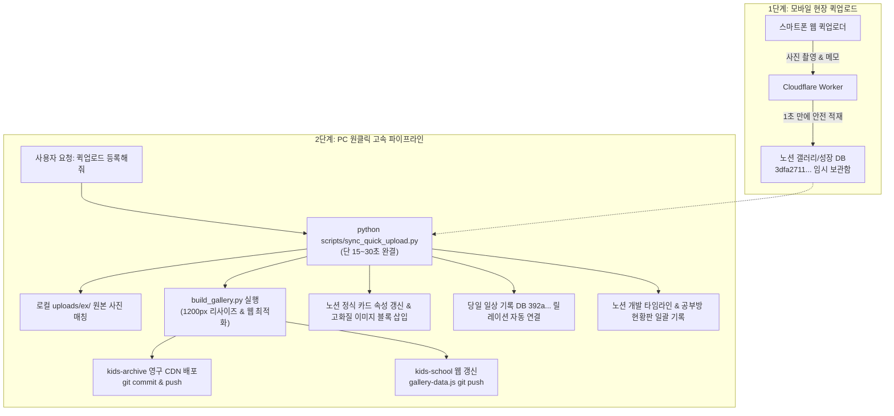

# 🎨 꿈나무 갤러리 · 성장 아카이브 · 퀵업로드 상세 명세서 (Gallery & Growth Archive Spec)

> **문서 버전**: v1.0.0 (2026-09-29 기준)  
> **관할 도메인**: 꿈나무 갤러리 웹(`gallery.html`), 특별한 날 아카이브(`special_days.html`), 12년 성장 미디어 단일 원천(`kids-archive`), 모바일 퀵업로더 2단계 파이프라인  
> **상위 헌법**: `GEMINI.md` (규칙 0호 공식 주소 체계, 규칙 11호 성장 아카이브 단일 원천, 규칙 13호 세션별 도메인 가드)  
> **연계 명세서**: `docs/timetable_diary_spec.md` (종이일기 연동), `docs/haru_spec.md` (특별한 날 연계)

---

## 1. 시스템 핵심 아키텍처 (SSOT & 2단계 하이브리드 파이프라인)

꿈나무 갤러리와 성장 아카이브는 **영구 보존 저장소 분리(kids-archive 단일 원천)**와 **모바일 퀵업로드 ➔ PC 원클릭 고속 배포**의 2단계 파이프라인으로 운용됩니다.

### 1) kids-archive 영구 보존 단일 원천 원칙 (규칙 11호)
- **12년 성장 기록 영구 보존**: 초등/중등/고등 12년간의 모든 작품, 상장, 활동 사진은 영구 보존용 단일 원천 레포지토리인 **`kids-archive`** (`https://github.com/awslike6-web/kids-archive`)에만 보관합니다.
- **공부방 레포지토리(kids-school) 0MB 경량화**: `kids-school`은 깃허브 권장 용량(1GB)을 방어하기 위해 작품 사진을 내부에 저장하지 않으며, `kids-archive`의 GitHub CDN 링크(`https://raw.githubusercontent.com/awslike6-web/kids-archive/main/assets/media/...`)를 직접 참조합니다.

---

## 2. 핵심 파일 맵 및 저장소 구조 (File Map)

| 위치 / 저장소 | 파일 경로 | 핵심 역할 |
| :--- | :--- | :--- |
| **`kids-school`** | [`gallery.html`](file:///g:/master-tower/kids-school-main/gallery.html) | 꿈나무 갤러리 메인 뷰포트 (카테고리 필터, 반응형 그리드, 모달 뷰어) |
| **`kids-school`** | [`kids/data/gallery-data.js`](file:///g:/master-tower/kids-school-main/kids/data/gallery-data.js) | 프론트엔드 갤러리 마스터 데이터 (CDN 이미지 직결, 좋아요/스티커) |
| **`kids-school`** | [`kids/data/gallery-meta.json`](file:///g:/master-tower/kids-school-main/kids/data/gallery-meta.json) | 개별 작품 커스텀 메타데이터 (제목, 분야, 작가의 한마디, 서브이미지 번들) |
| **`kids-school`** | [`kids-school-main/scripts/build_gallery.py`](file:///g:/master-tower/kids-school-main/scripts/build_gallery.py) | 갤러리 자동 최적화 빌더 (1200px 리사이즈, kids-archive 배포, JS 갱신) |
| **`kids-archive`** | [`kids-archive/data/archive-master-data.js`](file:///g:/master-tower/kids-archive/data/archive-master-data.js) | 평생 성장 포트폴리오 마스터 DB (초중고 단일 원천) |
| **`kids-archive`** | `kids-archive/assets/media/{자녀}/{학기}/` | 웹 최적화된 고화질 영구 미디어 파일 |
| **`master-tower`** | [`scripts/sync_quick_upload.py`](file:///g:/master-tower/scripts/sync_quick_upload.py) | **원클릭 고속 파이프라인 실행기 (15~30초 완결)** |

---

## 3. 모바일 퀵업로드 2단계 파이프라인 운용 표준

### 1단계 [모바일 퀵업로드]: 현장에서 간편 등록
- 스마트폰 브라우저에서 퀵업로더 접속 (`/gallery.html` 또는 바로가기).
- 사진 촬영/선택 ➔ 자녀(민서/민수) 선택 ➔ 메모 작성 ➔ 전송.
- Cloudflare Worker가 노션 성장 DB(`3dfa27115b688010a85be385f91d64ee`)에 즉시 적재:
  - `식별ID`: `[퀵업로드] 자녀_YYYY-MM-DD (메모)`
  - `구분`: `작품` 또는 `종이일기`
  - `주인공`: `민서` 또는 `민수`

### 2단계 [PC 동기화]: 원클릭 일괄 배포
- PC에서 원본 사진이 로컬 `uploads/ex/` 폴더에 동기화되면, 에이전트에게 **"퀵업로드 올린 거 등록해줘"**라고 요청.
- 에이전트는 복잡한 개별 작업을 수행하지 않고 **`python scripts/sync_quick_upload.py`를 단 1회 실행**하여 15~30초 만에 완결.

---

## 4. 다중 사진 번들링 (사진 2장 이상 1개 카드 묶기)

- **원칙**: 수료증(표지+본문), 만들기 과정 사진, 입체 작품 등 동일한 대상의 사진이 2장 이상일 때는 갤러리 카드를 무분별하게 여러 개로 쪼개지 않고 **1개의 카드로 번들링**합니다.
- **구현 방식**:
  - `gallery-meta.json`의 해당 작품 항목에 `"subImages": ["파일명2.png", "파일명3.png"]` 지정.
  - 빌더가 자동으로 `galleryImages` 배열로 묶고, 갤러리 카드에 **`📷 N장` 배지** 및 모달 썸네일 스위처를 자동 생성.

---

## 5. 새 대화창(세션) 인계 프로토콜 (Handover Protocol)

사용자가 새 대화방을 열어 갤러리/아카이브 작업을 요청할 때, 에이전트는 본 명세서(`docs/gallery_archive_spec.md`)를 즉시 참조하여 다음 수칙을 준수합니다.

1. **사용자가 "퀵업로드 올린 거 등록해줘"라고 할 때**:
   - 불필요하게 긴 생각이나 여러 단계의 수동 스크립트를 작성하지 않는다.
   - 📌 **작업 내용**: `python scripts/sync_quick_upload.py` 실행
   - 🎯 **목적/이유**: 모바일 퀵업로드 항목을 고속으로 일괄 최적화 및 깃/노션 배포하기 위함
   - 위 명령 1회 실행 후 완료 보고를 드린다.
2. **다중 사진 번들링이나 신규 수동 등록일 때**:
   - `kids/data/gallery-meta.json`에 메타데이터(제목, 분야, 작가의 한마디, subImages)를 먼저 기록한 뒤 `sync_quick_upload.py` 또는 `build_gallery.py`를 실행한다.
3. **손글씨 종이일기일 때**:
   - 손글씨 내용을 1글자의 누락 없이 100% 정성껏 전사하고, `kids-archive/assets/media/minsu/paper_diary/`에 고화질 최적화 저장 후 노션 페이지 본문 콜아웃에 반영한다.
