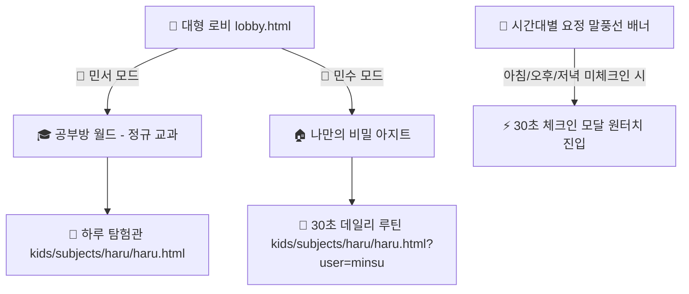

# 🌅 통합교과 '하루' 및 데일리 루틴·성장 아카이브 통합 명세서 (haru_spec.md)

## 1. 개요 및 설계 철학
* **문서 목적**: 초등학교 1학년 2학기 통합교과 **'하루'** (민서)와 초등학교 5학년 **'30초 데일리 루틴 & 저금통'** (민수)의 데이터 구조, 화면 아키텍처, 12년 성장 아카이브 연동 표준을 정의하는 단일 원천(SSOT) 명세서.
* **핵심 철학**:
  1. **무오답·무감점 원칙**: 국어/수학처럼 점수 매기고 오답노트를 남기는 평가식 접근을 일체 배제하고, 100% 칭찬과 성취감(동요, 명화, 습관 체크, 감정 도장)으로 구동한다.
  2. **대화의 마중물 (Conversation Anchor)**: 부모가 올린 학교 활동 사진과 아이의 감정 도장을 매개로 저녁 식탁에서 따뜻한 가족 대화가 피어나도록 유도한다.
  3. **단일 원천 & 무복제 (Zero Media Duplication)**: 공부방 레포지토리(`kids-school`)의 용량을 0MB로 유지하기 위해, 사진 바이너리 원본은 영구 보존 레포(`kids-archive`)에 보존하고 웹은 GitHub CDN URL로만 참조한다.

---

## 2. 자녀별 맞춤 이원화 진입 파이프라인 (Dual Entry Pipeline)



| 자녀 구분 | 학년 | 진입 경로 (URL) | 로비 배치 구역 | 헤더 배지 & 통화 |
| :--- | :---: | :--- | :--- | :--- |
| **👧 민서 (daughter)** | 초1 | `kids/subjects/haru/haru.html` | `[🎓 공부방 월드]` 정규 교과 | 1-2 통합교과 / 하리보 젤리 (`🍬`) |
| **👦 민수 (son)** | 초5 | `kids/subjects/haru/haru.html?user=minsu` | `[🏠 나만의 아지트]` 자립 룸 | 5학년 데일리 라이프 / 다이아 (`💎`) |

### 📢 로비 시간대별 지능형 말풍선 분기
- **아침 (05:00 ~ 11:59)**: 미체크인 시 등교 전 저금통 코인 및 보상 획득 독려 ➔ 완료 시 교과 퀘스트 출격 안내.
- **오후 (12:00 ~ 17:59)**: 미체크인 시 하교 후 착한 습관/운동 체크인 유도 ➔ 완료 시 당일 시간표 복습(1.2배 부스트) 안내.
- **저녁 (18:00 ~ 04:59)**: 미체크인 시 잠들기 전 루틴 마무리 ➔ 완료 시 당일 폰시간 정산 영수증 발급 안내.

---

## 3. 하루 방 5대 핵심 탭 아키텍처

### 1) 🌤️ 탭 1: 자연 & 예술 감상실 (Nature & Art)
- **하늘의 하루 (22~23쪽)**:
  - **낮의 하늘 ☀️**: 클로드 모네 `포플러 나무가 있는 풀밭` + 대표 팔레트 4색 + 요정 코코 음성 해설.
  - **밤의 하늘 🌙**: 빈센트 반 고흐 `별이 빛나는 밤` + 소용돌이 별빛 팔레트 + 요정 코코 음성 해설.
  - **나만의 하늘 감상평**: 관찰 소감을 입력하고 저장 시 젤리/다이아 +2개 지급.
- **달팽이의 하루 (24~25쪽)**:
  - 달팽이 동요 가사 낭독 + `playRainSound()` 빗소리 자연 ASMR (Web Audio API 백그라운드 재생).

### 2) 🐷 탭 2: 매일의 습관 & 루틴 (Daily Habits & Routines)
- **착한 습관 저금통 (30~31쪽)**:
  - 6대 습관: `📖 독서`, `🧹 방정리`, `👟 신발정리`, `🥦 야채먹기`, `🏃 줄넘기/달리기`, `💬 다정한인사`.
  - 착한 일을 할 때마다 동전 누적 (+1 코인), **20칸 완주 시 마이룸 `[🏆 황금 돼지 트로피]` 가구 자동 언락 & 주말 가족 소원권 1장 발급**.
- **건강한 하루 운동 도장 (26~27쪽)**:
  - 5대 운동: `🧘 스트레칭`, `🏃 걷기/달리기`, `🪢 줄넘기`, `💃 댄스`, `🛴 자전거/킥보드`.
- **마음의 하루 감정 무지개 (28~29쪽)**:
  - 5대 감정: `😊 기쁨/행복`, `🥳 신남/설렘`, `🌿 편안함/차분함`, `😢 슬픔/속상함`, `😤 화남/답답함`.
- **⚡ 30초 원스톱 하루 체크인 익스프레스 (`quickCheckInModalOverlay`)**:
  - `습관 ➔ 운동 ➔ 마음` 3단계를 30초 만에 탭 터치로 끝내는 모바일 최적화 모달.
  - 완료 시 노션 학습일지 DB(`37aa2711...`)에 `[30초 하루 체크인]` 카드로 실시간 전송 (SWR 백그라운드 저장).

### 3) 🏆 탭 3: 특별한 날 추억 피드 & 성장 아카이브 (Special Days)
- **폴라로이드 스타일 감성 포토 카드**:
  - 카테고리 칩: `🌱 생태/텃밭`, `🎒 학교활동`, `🍁 소풍/현장학습`, `🎂 가족/생일파티`, `🌿 자연관찰`, `⭐ 소중한하루`.
- **📷 3장 사진 원터치 썸네일 전환 (`switchCardPhoto`)**:
  - 메인 사진 하단에 썸네일 바가 제공되어, 터치 시 즉시 메인 화면의 사진이 전환됨.
- **✏️ 카드 제목 인라인 에디터 (`saveEditedTitle`)**:
  - 제목 우측 `✏️` 버튼 클릭 시 인라인 입력창 오픈 ➔ [저장] 시 `localStorage` 즉시 반영 및 화면 갱신.
- **💮 아이 주도 감정 도장 (`stampReaction`)**:
  - 4대 프리셋: `[😆 꿀잼]`, `[😲 신기해]`, `[🧺 뿌듯해]`, `[😋 고소해]`.
  - **`[✏️ 직접 쓰기]` 인라인 입력**: 아이가 자신만의 생각(예: *"벌레가 신기했어!", "엄마 줄 땅콩"* 등 15자)을 직접 타이핑하여 도장 쾅!
  - 도장 찍는 순간 **젤리/다이아 +2개 보상** 지급 + 요정 코코 축하 음성 + `[💖 민서의 소감: 💮 ...] (날짜)` 도장 영구 보존.

### 4) 🚨 탭 4: 출동! 119 안전 수호대 & 닥터 코코 응급처치 상담소 (Safety & First Aid)
- **교과 연계**: 초등 1-2학년 통합교과 74~83쪽 (위험/안전 및 사고 예방 단원).
- **🚒 위기탈출 OX 안전 퀴즈 (6문항 시뮬레이션)**:
  - 6대 생활 위험 상황: `학교 복도와 계단`, `횡단보도 건널 때`, `교실 날카로운 도구(가위/칼)`, `미끄럼틀/놀이터`, `비 오는 날 우산 쓰기`, `다쳤을 때 어른께 알리기`.
  - **무감점·다정한 힌트 원칙 (규칙 14/16항)**: 오답을 골라도 붉은 X나 감점 없이 코코가 "괜찮아! 복도에서는 친구와 부딪힐 수 있으니 사뿐사뿐 걷는 게 안전해!"라는 격려 힌트를 제공하여 100% 면허증 취득으로 유도.
  - **🏆 황금 안전 지킴이 면허증 발급**: 6문항 완주 시 금빛 테두리 증명 면허증 렌더링 + 보너스 젤리/다이아 +5개 지급 + 노션 학습일지 자동 기록.
- **🩺 닥터 코코 365 응급처치 상담소**:
  - 학교나 집에서 다쳤을 때 아이가 스스로 찾아보고 대처할 수 있는 단계별 응급처치 가이드.
  - **6대 핵심 증상 칩**:
    1. `🩹 무릎/손 까짐 (찰과상)`: 찬물 세척 ➔ 물기 톡톡 ➔ 소독/연고 ➔ 밴드 부착
    2. `🤕 쿵 부딪힘 (혹/멍)`: 얼음수건 냉찜질 ➔ 비비지 않기 ➔ 어지러움 시 병원 가기
    3. `🔥 뜨거운 곳 데임 (화상)`: 미지근한 찬물 15분 식히기 ➔ 물집 보호 ➔ 된장/치약 절대 금지
    4. `🩸 코피가 주르륵`: 고개 앞으로 숙이기 ➔ 콧망울 5분 꾹 누르기 ➔ 입으로 호흡
    5. `🐝 벌레/모기 물림`: 비누로 씻기 ➔ 긁지 않기 ➔ 냉찜질 & 연고 도포
    6. `👀 눈에 모래/먼지`: 절대 비비지 않기 ➔ 식염수/찬물 깜빡이기 ➔ 안과 방문
  - **직접 질문 입력바**: "어디가 어떻게 다쳤나요?" 텍스트 입력 시 증상 키워드 분석 후 맞춤 처치법 노출.
  - **코코 음성 위로 & 처치 안내**: 다정한 음성(`speakText`)으로 아이의 놀란 마음을 진정시키고 단계별 행동 요령 낭독.

### 5) 🕰️ 탭 5: 24시간 매직 타임머신 시계판 (하루 일과 & 시간 표현, 32~57쪽)
- **교과 연계**: 초등 1학년 2학기 통합교과 『하루』 32~57쪽 (하루 일과 알아보기 및 아침/낮/저녁/밤 시간 표현).
- **압박 없는 자율 기록 아카이브**:
  - 매일 숙제처럼 강제하지 않고, 아이가 언제든 하루 일과 스티커를 붙이고 나중에 추억으로 돌아볼 수 있는 타임머신 캘린더 아카이브.
  - `◀ 어제`, `내일 ▶`, `오늘로 이동` 버튼으로 과거/미래 일과 자유 열람.
- **🌈 24시간 원형 매직 시계판 (4색 시간 다이얼)**:
  - 4대 시간대별 사분면 그라데이션:
    - 🌅 **아침 (06:00 ~ 11:59)**: 해가 방긋 핑크코랄 (`#ff7675`)
    - ☀️ **점심 (12:00 ~ 16:59)**: 푸른 하늘 스카이블루 (`#0984e3`)
    - 🌇 **저녁 (17:00 ~ 20:59)**: 노을빛 선셋오렌지 (`#e17055`)
    - 🌙 **밤 (21:00 ~ 05:59)**: 별이 빛나는 미드나잇퍼플 (`#6c5ce7`)
  - **시침(24시간 15도/h) & 분침(60분 6도/m)** 실시간 애니메이션 회전.
  - 시계판 스티커 핀 터치 시 시계 바늘이 해당 시간으로 이동하며 요정 코코가 일과 음성 낭독.
- **🎨 20종 하루 일과 스티커 팩 + ✏️ 나만의 일과 직접 쓰기**:
  - 기상, 아침밥, 양치, 가방 챙기기, 등교, 수업, 급식, 도서관, 하교, 놀이터, 학원, 숙제, 저녁식사, 가족놀이, 목욕, 잠자리 등 20종 원터치 붙이기.
  - `[✏️ 나만의 일과 직접 쓰기]` 모달: 시간, 12종 감성 이모지, 제목(최대 18자), 한 줄 생각(최대 35자) 자유 입력 지원.
- **✨ 오늘 하루 완성 보너스 & 노션 학습일지 연동**:
  - 스티커 3개 이상 등록 후 `[✨ 오늘 하루 완성하기]` 터치 시 **보너스 지급 (+2🍬/💎)**.
  - 노션 학습일지 DB(`37aa2711...`)에 일과 내역 자동 적재 (오프라인 모드 안전 지원).

---

## 4. 학교 활동 사진 영구 보존 파이프라인 (kids-archive 연동)

### 1) 디렉토리 및 파일 인박스 구조
- **로컬 업로드 인박스**: `kids-school-main/uploads/ex/갤러리/하루아카이브/`
  - 📂 `민서/` (민서 학교 활동 사진 보관)
  - 📂 `민수/` (민수 학교/센터 활동 사진 보관)
  - 📂 `공통/` (남매 및 가족 행사 사진 보관)
- **아카이브 영구 배포처**: `kids-archive/assets/media/{child}/activities/`

### 2) 빌더 스크립트 (`scripts/add_activity_photo.py`)
```bash
# 마법사 모드 (인자 없이 실행 시 폴더 자동 스캔 및 알림장 복붙으로 완료)
python scripts/add_activity_photo.py

# CLI 직접 지정 모드
python scripts/add_activity_photo.py \
  --file "경로/사진.jpg" \
  --child minseo \
  --title "가을 텃밭 땅콩 수확하기" \
  --desc "5학년 선배들이 키운 땅콩을 선물받아 수확했어요!" \
  --category "생태/텃밭" \
  --date "2026-09-10"
```
- **빌더 자동화 4단계**:
  1. **1200px 리사이즈 & 압축**: EXIF 회전 보정 및 고화질 압축(quality=88).
  2. **GitHub CDN 주소 생성**: `https://raw.githubusercontent.com/awslike6-web/kids-archive/main/assets/media/{child}/activities/{filename}`
  3. **데이터베이스 동시 등록**: `archive-master-data.js` & `haru_data.js`의 `defaultEvents` 배열에 원자적 추가.
  4. **원클릭 Git 자동 푸시**: `kids-archive`에 사진 및 메타데이터를 자동 커밋 & 푸시.

---

## 5. 실시간 부모 대시보드 코칭 & 안심 알림 가이드 (`parent_dashboard.html`)
- **실시간 3열 그리드**: 아이가 태블릿에서 체크인한 `오늘 착한 습관`, `오늘 건강 운동`, `오늘 마음 날씨`가 부모 스마트폰 대시보드에 실시간 로드됨.
- **맞춤형 부모 칭찬 큐시트 (AI 멘트 가이드)**:
  - 신발 정리, 수업 준비물, 청결 위생 등 아이가 실천한 항목에 맞추어 저녁 식탁에서 건넬 수 있는 다정한 칭찬 대화문 제시.
- **저금통 완주 게이지**: 20칸 중 현재 누적 코인 및 달성률(%) 시각화.
- **🚨 닥터 코코 실시간 안심 알림 위젯 (`renderSafetyAlertWidget`)**:
  - 아이가 공부방에서 닥터 코코에게 다친 부위나 상처를 질문하면 **부모 대시보드에 붉은 안심 알림 배너가 즉시 노출**.
  - 시간, 상처 부위, 코코의 응급처치 안내 내역, 부모 안심 코칭(귀가 후 상처 점검 포인트)을 함께 표시하여 학교/야외 활동 후 귀가 시 안심 케어 지원.
  - 당일 상담 내역이 없을 때는 초록빛 **`[안전 상태 양호 🛡️]`** 배너로 무탈한 하루를 확인.

