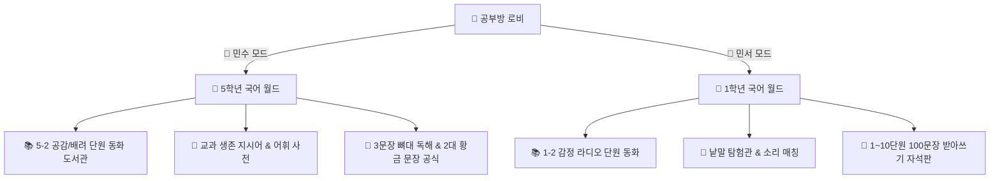

# 📖 초등 국어방 독해·받아쓰기·공감동화 통합 명세서 (korean_spec.md)

## 1. 개요 및 설계 철학
* **문서 목적**: 초등학교 5학년 2학기 국어(민수)의 중학교 일반학급 연착륙 대비와 초등학교 1학년 2학기 국어(민서)의 100문장 받아쓰기·기초 어휘 사다리를 체계화하는 **국어방 단일 원천(SSOT) 명세서**.
* **핵심 철학**:
  1. **실패 없는 학습 (Errorless Learning - 절대 원칙)**:
     - 오답에 대한 거부감과 스트레스가 큰 아이들을 위해 감점, 경고음, 붉은 X 표시를 일체 배제한다.
     - 오답 선택 시 "힌트 디딤돌"과 부드러운 애니메이션이 작동하여 스스로 100% 성공과 성취감으로 마무리하도록 돕는다.
  2. **자녀별 맞춤 이원화 (Dual Profile Integration)**:
     - **👦 민수 (초5)**: `docs/minsu_learning_profile.md` 준수. 실질 난이도 3~4학년 조절, 중학 생존 무기 3종(지시어 50선, 2대 황금 문장 공식, 3문장 뼈대 발라내기) 집중 훈련.
     - **👧 민서 (초1)**: 1~10단원 교과 연계 100문장 받아쓰기 급수표 1:1 매칭, 슬라임 음절 자석 칩 조립(키보드 피로도 제로), 듣기 중심.
  3. **텍스트-오디오-삽화 삼위일체 (Zero Drift)**:
     - 동화책 화면 대사, 삽화 속 상황, 신경망 TTS(`edge-tts`) 음성은 단 1글자의 불일치도 없이 1:1로 완전 일치해야 한다.
     - `(이미지: ... 참고)` 등의 프롬프트 찌꺼기는 100% 제거하고 순수 서술문과 대화문만 노출한다.

---

## 2. 자녀별 맞춤 파이프라인 (Dual Pipeline)

| 구분 | 대상 학생 | 학년-학기 | 핵심 학습 축 | 테마 & 재화 |
| :--- | :---: | :---: | :--- | :--- |
| **👦 민수** | 초5 | 5-2 | 공감 대화법, 생존 지시어 50선, 2대 황금 문장 서술형 방어 | 마인크래프트 / 다이아 (`💎`) |
| **👧 민서** | 초1 | 1-2 | 100문장 받아쓰기 1:1 급수 매칭, 음절 자석판, 맞춤법/띄어쓰기 | 슬라임 / 하리보 젤리 (`🍬`) |

---

## 3. 국어방 3단계 학습 사다리 아키텍처 (Universal 3-Stage Ladder)

### 1단계 [워밍업] : 📚 단원 동화 도서관 (Storybook Library)
- **진입로**: 국어방 상단 퀵 액션바 및 본문 1번 카드.
- **서가 탭 분리**: 도서가 많아져도 아이가 길을 잃지 않도록 `[✨ 전체보기]`, `[👦 민수 (5학년)]`, `[👧 민서 (1학년)]` 3대 탭으로 분류.
- **듀얼 뷰어 엔진 (`storybook_engine.js`)**:
  - `📖 E-Book 책 넘김 뷰어`: 좌측 고화질 삽화 + 우측 본문 펼침면, 한 장씩 넘기며 음성 감상, 자동 넘김 지원.
  - `📜 웹툰 스크롤 뷰어`: 모바일/태블릿 세로 스크롤, 컷별 카드형 나열, '처음부터 연속 낭독' 플레이어 탑재.
- **완독 보상**: 완독 축하 모달 + 재화(+3💎/🍬) 및 국어 경험치(+10 EXP) 일관 지급.

### 2단계 [기초 빌드업] : 🧩 낱말 탐험관 (Vocabulary Explorer)
- **노션 VOCA DB 실시간 연동**: 학년별/과목별 단어, 뜻풀이, 예문 실시간 쿼리.
- **체류형 어휘 정독 탐구 보상 (`window.grantVocaDwellReward`)**:
  - 문제를 풀지 않고 단어 카드를 **20초 이상 정독**하거나 요정 코코 TTS 음성 청취 시 해당 과목 **`용어 경험치` +3 및 보상 +1💎/🍬** 즉시 지급 (일 5회 상한).

### 3단계 [실전 딥 다이브] : 📝 실전 훈련 (Deep Dive)
- **👧 민서 (초1) : 슬라임 음절 자석판 받아쓰기**:
  - 100문장 급수표(1~10급)와 교과 단원(1~10단원) 1:1 직행 선택 그리드.
  - 화면에 흩어진 음절 칩(`[바]`, `[람]`, `[이]`, `[␣]`)을 톡톡 터치해 칠판 슬롯에 붙이는 에러리스 조립.
  - 음절 칩 배치 시 1학년 눈높이 캔디/파스텔톤 둥근 버튼 및 팝업 애니메이션.
- **👦 민수 (초5) : 3문장 뼈대 발라내기 & 황금 문장 서술 훈련**:
  - **생존 지시어 50선**: `원인/결과`, `공통점/차이점`, `적절한 것`, `주장/근거`, `경청`, `역지사지` 등.
  - **2대 황금 문장 공식**:
    - 공식 ①: `[원인-결과] "~때문에 ~했다"`
    - 공식 ②: `[주장-근거] "~생각한다. 왜냐하면 ~이기 때문이다"`
  - 5학년 수행평가 1문장 방어 훈련을 3지선다 콕 터치 방식으로 진행하여 부담감 제로화.

---

## 4. 제미나이 젬스(Gems) 스토리북 제작 표준 프로토콜

### 1) 이미지 에셋 디렉토리 표준
- 경로 규칙: `kids/subjects/korean/images/{학생}/{학년-학기}/{단원}/storybook/`
  - 예: 민수 5-2 1단원 ➔ `kids/subjects/korean/images/minsu/5-2/1/storybook/`
- 파일 규격:
  - 전면 펼침면: `korean_story_p{N}.png` (1650x1275)
  - 순수 삽화: `korean_story_ill_p{N}.png` (825x1275 좌측 크롭)
  - 전용 표지 삽화: `korean_story_cover.png` (서가 카드 1:1.5 비율 최적화)

### 2) 외부 AI(Gems) 소스 정제 원칙
- **프롬프트 찌꺼기 100% 필터링**: `(이미지: ... 참고)`, `[컷 설명: ...]`, 연출 캡션 등은 웹 텍스트 및 TTS 대본에서 일체 배제.
- **스토리 삼위일체 싱크**: 삽화 상황(예: 이어달리기 바통 분실) ➔ 화면 텍스트 ➔ `edge-tts` 음성이 한 글자의 오차도 없이 1:1 일치.
- **동화 본문 순수성**: 학습 배지(`webtoon-ref-badge`)는 동화 본문 내에 복잡하게 섞지 않고, 순수 대화와 서술문만 쾌적하게 렌더링.

### 3) 오디오 합성 및 저장 표준
- 경로: `kids/assets/audio/storybook/{과목}_{학년-학기}_{단원}/book{권}/p{페이지}.mp3`
- 음성 엔진: `edge-tts` (`ko-KR-SunHiNeural`), 배속 `+0%` (또는 민수 맞춤 저속).

---

## 5. 노션 데이터베이스 스키마 및 정렬 규칙

### 1) 노션 VOCA DB (`375a27115b688038b686d3994ee12919`)
* **주요 속성**:
  - `단어` (Title): 받아쓰기 문장 또는 교과 어휘
  - `과목` (Multi-select): `국어`, `받아쓰기`
  - `대상` (Multi-select): `민서`, `민수`
  - `학년` (Select): `1-2`, `5-2`
  - `단원` (Select/Rich text): `1회 (1. 소리와 모양을 흉내 내요)` ~ `10회`
  - `단계` (Number): 문항 순번 (1~10)
  - `뜻풀이` (Rich text): 어휘 풀이 또는 띄어쓰기 팁
* **정렬 알고리즘 (Sorting SSOT)**:
  - 데이터를 쿼리할 때 노션 기본 역순(최신순)으로 정렬되면 10번부터 거꾸로 노출되는 왜곡 발생.
  - **반드시 `createdTime` 오름차순(등록순)** 또는 `단계` 번호순으로 정렬하여 1번 ➔ 10번 교재 순서를 완벽히 보장할 것.

---

## 6. 보상 및 학습일지 가드레일 (StudyLog Guardrails)

1. **2문제당 1개 + 10문제 완주 보너스 원칙**:
   - 실시간 보상: 2문제마다 실시간 +1💎/🍬.
   - 완주 보너스: 10문제 완주 시 +5개 (예습 부스트 시 +7개).
2. **시간표 연동 데일리 부스트 (`timetable-boost.js`)**:
   - 당일 복습 과목: 일일 상한선 150개 확장, 경험치 1.2배.
   - 익일 예습 과목: 완주 보너스 +7개.
3. **부모/관리자 모드 데이터 격리 및 일기 정상 등록 보장**:
   - **교과 퀴즈 테스트**: 아빠/엄마 관리자 모드로 문제 풀이 시, 아이의 학습일지 통계 및 재화 오염 방지를 위해 `sendStudyLogToNotion`을 프리패스(가상 통과)한다.
   - **부모 마음일기 (예외 유지)**: 부모가 작성하는 '하루 마음일기' 및 아이 일기에 대한 '부모 피드백'은 소중한 패밀리 자산이므로, 학생 속성 `부모관리자`, 과목 `일기`로 학습일지 DB에 정상 적재하고 당일 일상 DB(`392a2711...`)와 양방향 관계형 연동을 온전히 유지한다.
