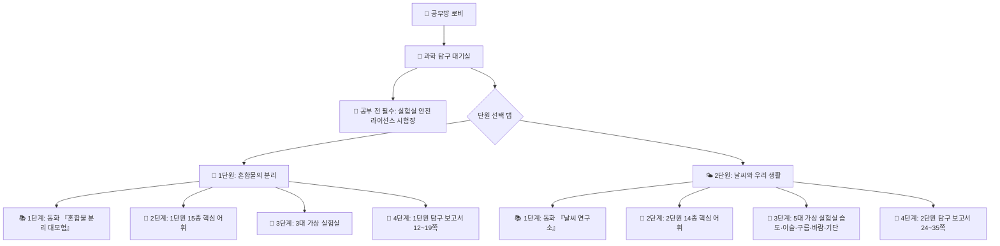

# 🔬 초등 과학 가상실험실·탐구보고서 통합 명세서 (science_spec.md)

## 1. 개요 및 설계 철학
* **문서 목적**: 초등학교 5학년 1학기(용해와 용액, 우리 몸) 및 5학년 2학기(혼합물의 분리, 날씨, 열, 자원) 과학 교과의 가상 실험 시뮬레이션 및 교과서 『실험관찰』 기록·평가를 융합한 **과학방 단일 원천(SSOT) 명세서**.
* **핵심 철학**:
  1. **가상 실험실(Virtual Lab)과 『실험관찰』의 유기적 결합**:
     - 눈으로만 읽는 교과서를 넘어, 직접 드래그·클릭하며 물리적 성질 차이(알갱이 크기, 밀도, 용해도, 증발)를 체득하는 인터랙티브 시뮬레이터를 제공한다.
  2. **실패 없는 탐구 (Errorless Science Learning)**:
     - 안전 수칙이나 실험 퀴즈 오답 시 감점 없이 친절한 원리 해설과 재도전 기회를 제공하여 100% 라이선스 합격 및 성취감을 부여한다.
  3. **관찰-결과-원리 3단계 계통적 학습 사다리**:
     - `[1단계 동화/배경지식]` ➔ `[2단계 안전/용어 기초]` ➔ `[3단계 가상실험 & 탐구보고서 딥다이브]`로 이어지는 프레임워크를 엄수한다.

---

## 2. 과학방 단원별 묶음 & 안전 선행 게이트 아키텍처

| 구분 | 스테이지 명칭 | 주요 학습 내용 | 인터랙션 및 보상 |
| :--- | :--- | :--- | :--- |
| **선행 필수** | **🥽 실험실 안전 라이선스** | 복장, 비상 대처, 가열 장치 안전 수칙 5문항 | 전원 만점 시 **골드 연구원증** 발급 (+10💎) |
| **1단원 팩** | **🧪 1단원 : 혼합물의 분리** | 동화(3권), 어휘 15종, 3대 분리 실험실, 탐구보고서 | 체 흔들기/스포이트/거름·증발 (+5💎) |
| **2단원 팩** | **🌤️ 2단원 : 날씨와 우리 생활** | 동화(4권), 어휘 14종, 5대 날씨 실험실, 탐구보고서 | 5대 실험실(습도/이슬/구름/바람/기단) (+5💎) |

---

## 3. 세부 모듈 상세 명세

### 1) 🥽 실험실 안전 라이선스 (`science_lab_data.js` : `SCIENCE_SAFETY_LICENSE_DATA`)
- **문항 구성**: 5문항 (실험 복장, 응급 대처, 유리 기구 다루기, 알코올 램프/가열기 안전, 폐수 분리배출).
- **합격 보상**: 5문항 전원 성공 시 `renderGoldLicenseCard` 실행 ➔ '공인 꼬마 과학자 골드 연구원증' 화면 노출 + 10💎 지급.

### 2) 🧪 인터랙티브 가상 실험실
- **1단원: 혼합물의 분리 (`science_virtual_lab.html`)**:
  - **실험 1: 🌾 체 흔들기 (알갱이 크기 차이 분리)**: 콩, 팥, 조가 섞인 바구니를 체에 붓고 흔들어 크기 차이로 분리.
  - **실험 2: 💧 물과 기름 스포이트 분리 (밀도 차이 분리)**: 뜬 식용유 층을 스포이트로 정밀 추출.
  - **실험 3: 🧂 소금-모래 2단계 분리 (용해도 & 증발 분리)**: 거름장치로 모래 분리 후 가열 증발로 소금 석출.
- **2단원: 날씨와 우리 생활 (5대 핵심 실험실 100% 완비)**:
  - **1차시: 🌡️ 건습구 습도계 (`science_hygrometer_lab.html`)**: 증발열 흡수에 따른 습구 온도 강하 및 건습구 습도표 인터랙티브 측정.
  - **2차시: 🧊 이슬과 안개 발생 (`science_dew_fog_lab.html`)**: 얼음물 캔 이슬 맺힘 및 집기병 향 연기 안개 응결 관찰.
  - **3차시: ☁️ 간이 페트병 구름 발생 (`science_cloud_lab.html`)**: 공기 주입 후 뚜껑을 열었을 때 단열 팽창에 의한 냉각과 뽀얀 구름 생성.
  - **4차시: 💨 바람이 부는 까닭 (`science_wind_lab.html`)**: 모래와 물의 가열/냉각 속도 차이로 생기는 고기압·저기압 및 대류 향연기 이동(해풍/육풍).
  - **5차시: 🌏 계절별 날씨와 공기 덩어리 (`science_season_airmass_lab.html`)**: 우리나라 사계절을 지배하는 4대 기단(시베리아, 북태평양, 오호츠크해, 양쯔강) 입체 지도, 사계절 체감 및 초여름 장마전선 충돌 시뮬레이터.

### 3) 📝 『실험관찰』 디지털 탐구 보고서 (`renderLabReportUI`)
- **단원별 완벽 분리 지원**:
  - `openScienceReport(1)` ➔ 1단원 혼합물의 분리 (교과서 『실험관찰』 12~19쪽 요약 및 퀴즈 5종)
  - `openScienceReport(2)` ➔ 2단원 날씨와 우리 생활 (교과서 『실험관찰』 24~35쪽 요약 및 퀴즈 5종)
- **2단계 탭 전환 구조**:
  - 📑 **[탭 1] 『실험관찰』 완벽 요약 노트**: 탐구 과정, 관찰 결과, 결론, '생각해 볼까요?'를 체계적으로 정리한 복습 문서.
    - 1단원: 체 분리(12쪽), 물·식용유(14쪽), 소금·모래 거름·증발(16~17쪽), 생활 속 분리·새활용(18~19쪽).
    - 2단원: 건습구 습도계(24~25쪽), 이슬·안개(26~27쪽), 구름 발생(28~29쪽), 해풍·육풍(30~31쪽), 계절별 기단(32~33쪽), 단원 정리 및 우리 생활(34~35쪽).
  - ✍️ **[탭 2] 인터랙티브 참여형 실전 퀴즈 (5종)**:
    - ① 빈칸 채우기 (단어 칩 터치 조립)
    - ② 객관식 4지선다 (원리 파악)
    - ③ 순서 맞추기 (실험 및 자연현상 절차)
    - ④ 실생활 적용 시나리오
    - ⑤ 스스로 평가하기 (메타인지 별점 평가) ➔ 완주 시 +5💎 지급.

### 4) 🔬 과학 용어방 2단계 동적 선택 엔진
- **노션 VOCA DB 실시간 연동**: 과목 `과학`, 학년 `5-1` / `5-2`, 영역 `용어방`.
- **단원 선택 화면 필수 보장**: 단원이 1개든 여러 개든 항상 단원 선택 화면을 거쳐 단어 수 배지(`15개 용어 🏷️`)를 확인 후 진입.

---

## 4. 리소스 및 에셋 디렉토리 표준
- **스토리북 이미지**: `kids/subjects/science/images/{학생}/{학년-학기}/{단원}/storybook/`
- **스토리북 오디오**: `kids/assets/audio/storybook/science_{식별자}/`
- **실험관찰/교재 사진**: `kids/subjects/science/images/`

---

## 5. 보상 및 학습일지 가드레일 (Rewards & StudyLog Guardrails)

1. **2문제당 1개 + 10문제 완주 보너스 원칙**:
   - 퀴즈/문제 풀이 시 정답 2문제마다 실시간 +1💎/🍬 즉시 지급.
   - 10문제 전량 완주 시 최종 완주 보너스 +5💎/🍬 (예습 부스트 시 +7💎/🍬) 지급.
2. **과학 특화 퀘스트 보상**:
   - 🥽 **실험실 안전 라이선스**: 5문항 전원 통과 시 '골드 연구원증' 발급 + 10💎/🍬 지급.
   - 📝 **『실험관찰』 디지털 탐구 보고서**: 요약 노트 정독 + 5종 실전 퀴즈 완주 시 +5💎/🍬 지급.
3. **체류형 어휘 정독 탐구 보상 (`window.grantVocaDwellReward`)**:
   - 과학 용어방에서 단어 카드를 **20초 이상 정독**하거나 요정 코코 TTS 음성 청취 시 **용어 EXP +3 및 +1💎/🍬** 즉시 지급 (일 5회 상한).
4. **시간표 연동 데일리 부스트 (`timetable-boost.js`)**:
   - **오늘 복습 과목**: 일일 보상 상한 100개 ➔ **150개 대폭 확장**, 경험치 **1.2배** 가산.
   - **내일 예습 과목**: 10문제 완주 보너스 기본 +5개 ➔ **+7개** 지급.
5. **학습일지 자동 기록 및 오답노트 수집**:
   - 퀴즈 풀이 중 오답 발생 시 `window.wrongNotes`에 자동 수집하여 노션 학습일지 DB(`37aa2711...`)의 `오답리포트`에 반영.
   - `isLogged` 락 및 `pagehide` 이탈 가드로 1세션 1회 안전 전송.
6. **스크린타임 스마트 정산소 연동 (`screentime-tracker.js`)**:
   - 실제 순수 공부 시간 10분 단위 올림 보정.
   - 당일 획득 보상 50개 달성 시 `[🎫 30분 자유 시간 추가권]` 1장 자동 발급.
   - 부모 대시보드(`parent_dashboard.html`)에서 실시간 조회 및 원클릭 승인 (`학습설정` 클라우드 연동).
