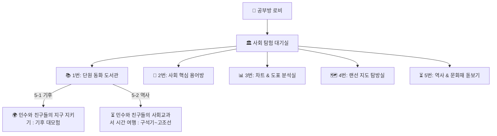

# 🏛️ 초등 사회 역사·지리 탐구방 통합 명세서 (society_spec.md)

## 1. 개요 및 설계 철학
* **문서 목적**: 초등학교 5학년 1학기(지리·기후) 및 5학년 2학기(옛사람들의 삶과 문화·역사) 사회 교과의 체계적 탐구와 인지 사다리를 규정하는 **사회방 단일 원천(SSOT) 명세서**.
* **핵심 철학**:
  1. **시각적·공간적 인지 사다리 (Spatial & Visual Scaffolding)**:
     - 추상적인 역사 연표나 복잡한 지형 개념을 2컷 인과 만화, 고화질 유물 사진, 인터랙티브 맵, 도표 시각화로 직관적으로 전달한다.
  2. **실패 없는 학습 (Errorless Learning - 절대 원칙)**:
     - 오답 선택 시 감점이나 경고음 없이, "힌트 디딤돌"과 확대 사진을 통해 아이가 스스로 100% 성공과 성취감으로 마무리하도록 돕는다.
  3. **학기별 도서관 서가 단일화 (Single Storybook Library)**:
     - 흩어진 스토리북 링크를 **`📚 사회 단원 동화 도서관` 단일 모달**로 통합하고, 학기별(5-1 기후 vs 5-2 역사)로 명확히 분리하여 학습 경로를 안내한다.

---

## 2. 사회방 4대 탐구 파이프라인 + 1대 도서관 아키텍처

| 구분 | 스테이지 명칭 | 주요 학습 내용 | 인터랙션 특징 |
| :--- | :--- | :--- | :--- |
| **1번** | **📚 단원 동화 도서관** | 교과서 배경지식 & 흥미 유발 | E-Book 책 넘김 뷰어 & 웹툰 세로 스크롤 뷰어 + 성우 낭독 |
| **2번** | **📖 사회 핵심 용어방** | 교과서 핵심 한자 용어 정복 | 2단계(학년/학기 ➔ 단원) 동적 UI + 한자 어원 분해 + 20초 정독 보상 |
| **3번** | **📊 차트 & 도표 분석실** | 인구·교통·지형 통계 그래프 해독 | 4지선다 분석 퀴즈 & 교과서 그래프 시각화 |
| **4번** | **🗺️ 랜선 지도 탐방실** | 한반도 지형, 행정구역, 랜드마크 | 백두산·독도·성산일출봉 인터랙티브 탐방 & 1줄 탐방록 |
| **5번** | **⏳ 역사 & 문화재 돋보기** | 시대별 핵심 유물 도감 수집 | 유물 카드 짝 맞추기 게임 & 나만의 유물 도감 |

---

## 3. 세부 모듈 표준 및 구현 가이드

### 1) 📚 단원 동화 도서관 (Storybook Library)
- **진입로**: 상단 퀵 액션바 (`📚 사회 동화 도서관`) 및 메인 그리드 1번 카드 (`openMissionView('storybook')`).
- **서가 목록 (`SOCIETY_STORYBOOK_LIBRARY`)**:
  - **[5학년 1학기]**: 🌍 `2단원 : 우리 국토의 기후` (`climate_storybook.html`) - 날씨와 기후 차이, 바람, 온실가스 줄이기.
  - **[5학년 2학기]**: ⏳ `1단원 : 옛사람들의 삶과 문화` (`history_time_travel_storybook.html`) - 박물관 유물함, 주먹도끼, 빗살무늬 토기, 고인돌, 8조법.
- **웹툰 모드 시인성 표준**:
  - `history_ill_p{N}.png`는 **1100x1700 단일 삽화**로 크롭하여, 웹툰 모드에서 `[상단 고화질 삽화] ➔ [하단 대사 텍스트]` 구조를 100% 보장.
- **음성 싱크 표준**:
  - 표지(1장)부터 귀환(10장)까지 실제 책 대사 텍스트와 `edge-tts` (`ko-KR-SunHiNeural`) 음성이 1:1로 완전 일치.

### 2) 📖 사회 핵심 용어방 (Vocabulary Room)
- **2단계 동적 선택 엔진**:
  - `[1단계: 학년/학기 고르기]` ➔ `[2단계: 세부 단원 고르기]` ➔ `[3단계: 초성 퀴즈 & 요정 낭독]`.
- **체류형 어휘 정독 탐구 보상 (`window.grantVocaDwellReward`)**:
  - 단어 카드를 **20초 이상 정독**하거나 요정 코코 TTS 음성 청취 시 **용어 EXP +3 및 +1💎/🍬** 즉시 지급 (일 5회 상한).

### 3) 📱 모바일 UI 표준
- `.top-action-bar`는 `position: relative`로 배치하여 모바일 스크롤 시 화면을 가리지 않도록 한다.

---

## 4. 리소스 및 에셋 디렉토리 표준
- **스토리북 이미지**: `kids/subjects/society/images/storybook/{식별자}/`
  - 펼침면: `history_story_p{N}.png` (2200x1700)
  - 단일 삽화: `history_ill_p{N}.png` (1100x1700)
- **스토리북 오디오**: `kids/assets/audio/storybook/society_{식별자}/`
  - 파일명: `history_story_p{N}.mp3` (10개 파일)
- **교재 사진 자료**: `kids/subjects/society/images/{학생}/{학년-학기}/{단원}/`

---

## 5. 보상 및 학습일지 가드레일 (Rewards & StudyLog Guardrails)

1. **2문제당 1개 + 10문제 완주 보너스 원칙**:
   - 퀴즈/문제 풀이 시 정답 2문제마다 실시간 +1💎/🍬 즉시 지급.
   - 10문제 전량 완주 시 최종 완주 보너스 +5💎/🍬 (예습 부스트 시 +7💎/🍬) 지급.
2. **체류형 어휘 정독 탐구 보상 (`window.grantVocaDwellReward`)**:
   - 사회 핵심 용어방에서 단어 카드를 **20초 이상 정독**하거나 요정 코코 TTS 음성 청취 시 **용어 EXP +3 및 +1💎/🍬** 즉시 지급 (일 5회 상한).
3. **시간표 연동 데일리 부스트 (`timetable-boost.js`)**:
   - **오늘 복습 과목**: 일일 보상 상한 100개 ➔ **150개 대폭 확장**, 경험치 **1.2배** 가산.
   - **내일 예습 과목**: 10문제 완주 보너스 기본 +5개 ➔ **+7개** 지급.
4. **학습일지 자동 기록 및 오답노트 수집**:
   - 도표 분석, 지도 탐방, 역사 돋보기 퀴즈 오답 발생 시 `window.wrongNotes`에 자동 수집하여 노션 학습일지 DB(`37aa2711...`)의 `오답리포트`에 반영.
   - `isLogged` 락 및 `pagehide` 이탈 가드로 1세션 1회 안전 전송.
5. **스크린타임 스마트 정산소 연동 (`screentime-tracker.js`)**:
   - 실제 순수 공부 시간 10분 단위 올림 보정.
   - 당일 획득 보상 50개 달성 시 `[🎫 30분 자유 시간 추가권]` 1장 자동 발급.
   - 부모 대시보드(`parent_dashboard.html`)에서 실시간 조회 및 원클릭 승인 (`학습설정` 클라우드 연동).
