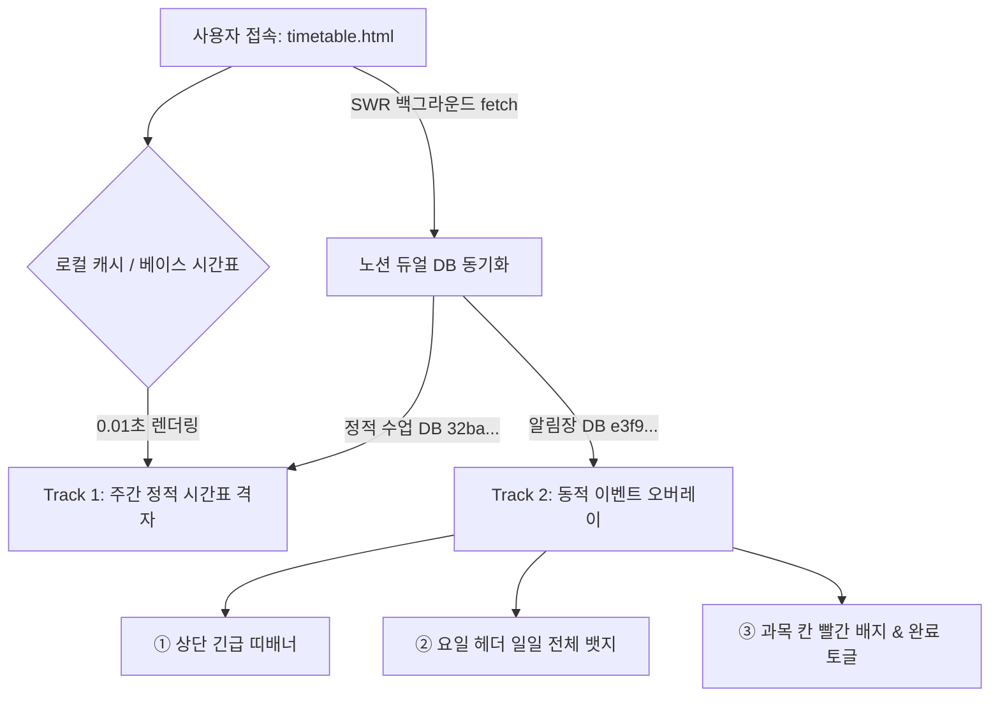

# 📅 시간표 · 알림장 · 일기 시스템 상세 명세서 (Timetable, Notice & Diary Spec)

> **문서 버전**: v1.0.0 (2026-09-11 기준)  
> **관할 도메인**: 주간 정적 시간표, 실시간 알림장/이벤트 오버레이, 하루 마음 일기 & 종이 일기 아카이빙  
> **상위 헌법**: `GEMINI.md` (프로젝트 규칙 준수)  
> **연계 명세서**: `docs/minsu_learning_profile.md` (민수 맞춤형 인지 프로필), `docs/haru_spec.md` (하루방 연계), `docs/homeschool_spec.md` (공부방 공통 구조)

---

## 1. 시스템 핵심 아키텍처 (2-Track 하이브리드 오버레이)

시간표 시스템은 **오프라인 즉시 렌더링(정적 베이스)**과 **클라우드 실시간 알림장(동적 오버레이)**이 결합된 2-Track 구조로 작동합니다.



### 1) Track 1: 정적 주간 시간표 (Static Base)
- **역할**: 학기 중 매주 반복되는 월~금 1~6교시(+0교시 아침활동, 하교 후 학원/수영/센터) 기본 수업.
- **방어 원칙**: 노션 통신이 지연되거나 오프라인 환경이어도 `timetable_controller.js`의 `DEFAULT_BASE_TIMETABLE`에 의해 0.01초 만에 화면이 뜨며 절대 백지화되지 않는다.

### 2) Track 2: 동적 이벤트/알림장 오버레이 (Dynamic Overlay)
- **역할**: 특정 날짜의 준비물(🎒), 단축수업/현장학습(🚩), 긴급 학교 공지(📢).
- **3대 노출 레이어**:
  1. **상단 띠배너 (`#topNoticeBannerArea`)**: 적용 범위 `전체 공지`인 긴급 학사 일정.
  2. **요일 헤더 뱃지 (`th .day-event-badge`)**: 적용 범위 `일일 전체`인 단축수업, 행사, 복장, 급식 공지.
  3. **과목 블록 뱃지 (`.lesson-overlay-badge`)**: 적용 범위 `과목별`인 준비물/숙제. 터치 시 모달 팝업 및 **`[챙겼어요! ✅]` 실시간 완료 토글(노션 즉시 패치)** 지원.

---

## 2. 핵심 파일 맵 및 DOM 무결성 가이드 (File Map & DOM Guard)

| 파일 경로 | 핵심 역할 및 무결성 유지 항목 |
| :--- | :--- |
| [`timetable.html`](file:///g:/master-tower/kids-school-main/timetable.html) | **시간표 뷰포트**: 85줄 초경량 HTML. DOM ID(`gridContent`, `noticeContent`, `filterTabs`, `clockTime`, `topNoticeBannerArea`, `noticeGuideBtn`, `overlayModalPortal`) **절대 변경/삭제 금지**. |
| [`kids/js/timetable_controller.js`](file:///g:/master-tower/kids-school-main/kids/js/timetable_controller.js) | **시간표 컨트롤러**: 격자 렌더링, 자녀 필터(`all`/`민수`/`민서`), `DEFAULT_BASE_TIMETABLE`, 모달 제어(`openOverlayItemModal`, `openNoticeGuideModal`). |
| [`kids/css/timetable.css`](file:///g:/master-tower/kids-school-main/kids/css/timetable.css) | **스타일시트**: 네온 칠판 테마, 반응형 듀얼 트랙, 모바일 스크롤 최적화. |
| [`kids/core/notion-timetable.js`](file:///g:/master-tower/kids-school-main/kids/core/notion-timetable.js) | **노션 시간표 통신 코어**: 워커 프록시 호출, 듀얼 DB 전량 쿼리, 교시 파싱(`parseTimetablePeriodSlot`), 완료 체크 패치. |
| [`kids/core/daily-diary.js`](file:///g:/master-tower/kids-school-main/kids/core/daily-diary.js) | **마음일기 코어**: 민서(풍선/나-전달법)/민수(바이브/목표) 일기 폼, 음성인식(STT), 학습일지 DB 등록, 당일 일상 DB 연동. |
| [`kids/config.js`](file:///g:/master-tower/kids-school-main/kids/config.js) | **글로벌 환경 설정**: 워커 프록시 URL, DB ID 모음. |

---

## 3. 노션 4대 연동 데이터베이스 명세 (Single Source of Truth)

모든 노션 호출은 Cloudflare Worker 프록시(`https://minmin-notion.awslike6.workers.dev/v1/`)를 통과하며, 헤더는 `Content-Type: application/json`, `User-Agent: Mozilla/5.0`을 표준으로 한다.

### 🏛️ DB 1: 고정 정적 시간표 DB (`32ba27115b68828bbda201a1bdce12fc`)
- **용도**: 학기별 매주 반복되는 정규 교과 수업.
- **주요 프로퍼티 스키마**:
  - `수업` (title): 제목 (예: `월요 1교시 난타`, `화요 4교시 국어`)
  - `아이` (select): `민수` | `민서`
  - `요일` (select): `월요일` | `화요일` | `수요일` | `목요일` | `금요일`
  - `교시` (select): `0교시` | `1교시` ~ `6교시` | `방과후` | `하교 후`
  - `과목` (select): `국어`, `수학`, `영어`, `사회`, `과학`, `도덕`, `음악`, `체육`, `미술`, `실과`, `난타`, `도서관`, `하루`, `수영장`, `센터` 등

### 🎒 DB 2: 동적 알림장 및 이벤트 오버레이 DB (`e3f9b3917c2b48bfa3d47db4bd0545fd`)
- **용도**: 특정 일자의 학교 알림장, 과목별 준비물, 행사, 공지사항.
- **주요 프로퍼티 스키마**:
  - `제목` (title): 공지 제목 (예: `알림장`, `국어 알림장`, `주간 글쓰기 과제 (1편)`)
  - `아이` (select): `민수` | `민서` | `공통`
  - `적용 범위` (select): `일일 전체` (요일 헤더) | `과목별` (해당 과목 칸) | `전체 공지` (상단 띠배너)
  - `과목` (select): `과목별` 적용 시 해당 과목 선택 (없으면 빈값)
  - `요일` (select): 적용 요일 (`월요일` 등)
  - `날짜` (date): `{"start": "YYYY-MM-DD"}` 또는 주간 기간형 `{"start": "YYYY-MM-DD", "end": "YYYY-MM-DD"}`
  - `완료` (checkbox): 준비물/과제 완료 여부 (`true` 시 취소선 및 체크)
  - `메모` (rich_text): 상세 숙제 내용 및 공지 본문
  - `알림` (date): 알림장 원본 수신 일자

### 📖 DB 3: 공부방 학습일지 및 마음일기 DB (`37aa27115b688001b2ffe5e6c8f82ab2`)
- **용도**: 공부방 웹에서 쓴 마음일기 및 종이 일기 전사 기록.
- **주요 프로퍼티 스키마**:
  - `ID` (title): `{학생}_{날짜} ({시간/부제})` (예: `민수_2026-09-08 (보건 수업과 척추)`)
  - `학생` (select): `민수` | `민서` | `부모관리자`
  - `과목` (rich_text): `일기` (민수/부모) 또는 `마음일기` (민서)
  - `감정날씨` (rich_text): 기분/바이브 (예: `😎 꿀잼·대만족 [강아지 체험]`)
  - `오답리포트` (rich_text): **일기 본문 내용 전문** 수록
  - `나-전달법` (rich_text): 다짐 및 한 줄 생각
  - `입장` / `퇴장` (date): 작성 시작/완료 시각
  - `AI 대화록 및 일상 기록 DB` (relation): 당일 일상 기록 DB(DB 4)와 **양방향 필수 연동**

### 🏡 DB 4: 라이프 메인 당일 일상 기록 DB (`392a27115b6880dba5eede7ff33a22b9`)
- **용도**: 하루의 모든 활동(일상, 일기, 개발 타임라인, 운동)을 총망라하는 부모-패밀리 통합 일지.
- **연동 규칙**: 일기나 개발 타임라인 등록 시 당일 레코드(`YYYY-MM-DD 일상 기록`)가 없으면 자동 생성 후 관계형으로 연결한다.

---

## 4. 실전 알림장 등록 3대 헌법 (Operational Rules)

알림장 입력 시 아래 3대 규칙을 절대적으로 준수한다.

### 📜 규칙 ①: 실행일(내일 등교일) 기준 등록 원칙 (SSOT)
- **원칙**: *"알림장은 받은 날이 아니라, 아이가 가방을 메고 학교에 가는 날(내일 등교일)의 시간표에 꽂아둔다!"*
- **이유**:
  - **오늘 저녁 가방 쌀 때**: '내일' 세로 한 줄만 위에서 아래로 훑어보면 [하루 전체 공지 + 과목별 준비물]이 한눈에 파악됨.
  - **내일 아침 등교 직전**: 당일 시간표 헤더에 알림장이 그대로 살아있어 빼먹지 않고 최종 점검 가능.
  - **수신 시각 보존**: 알림장 수신 시간은 노션의 `생성일(created_time)` 및 `알림` 속성에 안전하게 자동 보존됨.

### 📜 규칙 ②: 주간 과제(글쓰기/독서록 등) 기간형 등록
- **원칙**: 1주일 중 1회 수행하는 과제는 시작일~종료일 **기간형(`start: 월요일, end: 금요일`)**으로 등록한다.
- **효과**: 한 주 내내 시간표 상단/공지판에 상시 유지되며, 과제를 완수한 날 화면에서 **`[챙겼어요! ✅]`**를 누르면 깔끔하게 완료(취소선) 처리된다.

### 📜 규칙 ③: 인지 부하 차단 (아이 맞춤 정제 원칙)
- **원칙**: 학교 전체 알림장 내용 중 우리 아이가 제외되거나 해당하지 않는 안내(예: 민수 제외 학습지 공지 등)는 **공지 본문에서 과감히 삭제**하고 등록한다.
- **이유**: 불필요한 공지는 민수와 민서에게 "나도 이걸 해야 하나?"라는 불필요한 혼선과 불안감을 유발하므로, 아이가 직접 해야 할 핵심 미션만 정제하여 등록한다.

---

## 5. 종이 일기 ➔ 디지털 전사 & 영구 아카이빙 파이프라인

아이들이 공책이나 스케치북에 손글씨로 쓴 일기는 다음 절차에 따라 보존한다:

```mermaid
graph LR
    A[종이 일기 사진 업로드] --> B[AI 시각 OCR 전사]
    B --> C[맞춤법 교정 & 격려 피드백]
    B --> D[노션 학습일지 DB 37aa... 등록]
    D --> E[당일 일상 기록 DB 392a... 관계형 연동]
    A --> F[uploads/ex/갤러리/{학생}/ 안전 저장]
    F --> G[build_gallery.py 실행 ➔ kids-archive 배포]
```

1. **텍스트 전사(OCR)**: 아이의 문장 구조, 귀여운 표현(예: 중성화 수술 ➔ 포경수술), 오탈자 수정 흔적(`않하고` ➔ `안 하고`)을 세심하게 읽어내어 기록한다.
2. **노션 DB 적재**: DB 3(`37aa...`)의 `오답리포트` 필드에 본문을 넣고, 본문 블록에도 예쁜 콜아웃과 문단으로 구성하여 등록한다.
3. **영구 미디어 보관**:
   - 원본 사진은 `uploads/ex/갤러리/{학생}/YYYYMMDD_{학생}일기_{주제}.jpg`로 복사.
   - `build_gallery.py` 실행 시 1200px 압축 후 영구 보존소인 **`kids-archive`** (`https://github.com/awslike6-web/kids-archive`)에 배포되어 12년 성장 아카이브로 영구 보존된다.

---

## 6. 2026학년도 2학기 최신 확정 정규 시간표 (Single Source of Truth)

### 👦 민수 (초등학교 5학년 2학기)
- **월요일**: 1.도덕 / 2.음악 / 3.영어 / 4.체육 / 5.수학 / 6.국어
- **화요일**: 1.과학 / 2.과학 / 3.사회 / 4.국어 / 5.미술 / 6.미술
- **수요일**: 0.피구(아침) / 1.사회 / 2.영어 / 3.창체(체육) / 4.국어 / 5.수학 / 8.센터
- **목요일**: 1.과학 / 2.영어 / 3.체육 / 4.음악 / 5.사회 / 6.수학
- **금요일**: 0.피구(아침) / 1.실과 / 2.실과 / 3.국어 / 4.국어 / 5.체육 / 6.창체 / 8.센터

### 👧 민서 (초등학교 1학년 2학기)
- **월요일**: 1.난타 / 2.도서관 / 3.국어 / 4.수학 / 5.하루 / 8.수영장
- **화요일**: *(미확정 · 확보 시 추가 등록)*
- **수요일**: 1.체육 / 2.체육 / 3.국어 / 4.수학 / 5.하루
- **목요일**: 1.난타 / 2.국어 / 3.수학 / 4.하루 / 8.수영장
- **금요일**: 1.체육 / 2.체육 / 3.수학 / 4.하루

---

## 7. 대화방 도메인 경계 가드 및 타 시스템 연동 규칙

1. **전담 대화방 우선 원칙 (규칙 13항)**:
   - 본 대화방은 **[시간표 · 알림장 · 일기 전담 관제실]**이다.
   - 자산 관제탑, PnC 금융봇, 타 과목 교과 학습 등의 지시가 인입될 경우, 임의로 코드를 수정하지 않고 반드시 1회 확인을 요청한다.
2. **부모 모드 특권 UI (`noticeGuideBtn`)**:
   - 시간표 웹 접속자가 `아빠`, `엄마`, `어른`, `admin` 또는 모니터 뷰일 때만 **`[💡 알림장 등록 가이드]`** 버튼을 노출한다.
3. **작업 완료 후 노션 타임라인 기록 의무화 (규칙 2항)**:
   - 시간표 코드 수정 및 깃 푸시 완료 후 반드시 다음 스크립트를 실행하여 3계층 개발 DB에 기록한다:
     ```bash
     python scripts/log_dev_timeline.py --part "공부방" --zone "기지국 공통" --stage "완료" --title "작업 내용" --summary "세부 요약" --url "https://github.com/awslike6-web/kids-school"
     ```
