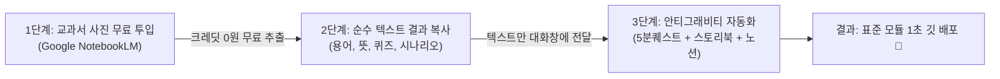

# 🚀 [SSOT] 공부방 단원 콘텐츠 제작 및 대화창 인계 공식 가이드 (unit_production_pipeline.md)

> **문서 목적**: 새 대화창(세션)을 개설하거나 다른 에이전트가 단원 제작 작업을 이어받을 때, 단 1%의 누락이나 기억 왜곡 없이 100% 동일한 표준으로 교과 콘텐츠를 조립·배포할 수 있도록 규정한 **단일 원천(SSOT) 인계 명세서**.

---

## 1. 3단계 제로-크레딧(Zero-Credit) 단원 제작 파이프라인

교과서 사진을 직접 안티그래비티 대화창에 대량 업로드하면 불필요한 이미지 토큰이 소모됩니다.
반드시 아래 **3단계 분업 파이프라인**을 준수합니다.



### [1단계] 부모님의 노트북LM 추출 프롬프트 표준
노트북LM에 교과서 사진(JPG/PDF)을 무료로 올리고, 아래 프롬프트를 복사하여 질문합니다:
> *"이 교과서 내용에서 다음 3가지를 정리해줘:*  
> *1) 핵심 어휘 5개 (단어, 뜻풀이, 초성힌트)*  
> *2) 5분 퀘스트용 4지선다 퀴즈 3문제 (질문, 4개 선택지, 정답, 1줄 해설)*  
> *3) 초등학생 눈높이의 흥미진진한 8장면 단원 동화 줄거리 (각 장면별 상황 묘사와 대화문)*"

---

## 2. 5분 퀘스트 & 노션 연동 규격 (최신 V2 아키텍처)

### 1) 4+1 듀오링고형 출제 구조
* **1~3번 [학교 진도 집중 드릴]**: 현재 단원 핵심 드릴 (정적 문제 + 노션 어휘 자동 융합)
* **4번 [망각곡선 자동 복습]**: 라이트너 3상자 간격 반복 큐 자동 소환 (3회 연속 정답 시 졸업)
* **5번 [🎁 다음 단원 비밀 맛보기]**: 다음 단원 맛보기 탐험 (틀려도 하트 0개 차감, 맞히면 경험치 2배)

### 2) 노션 용어사전(VOCA DB) 자동 합성 원칙
* **저장 위치**: 노션 VOCA DB (`375a27115b688038b686d3994ee12919`)
* **핵심 필드**: `단어`(title), `뜻풀이`(rich_text), `초성힌트`(rich_text), `과목`(multi_select), `학생`(multi_select), `단원`(rich_text/number), `이미지파일`(files/url), `인터랙티브 링크`(url)
* **엔진 동작**: `quest_engine.js`의 `buildVocaQuestionsFromNotion`이 당일 로컬 캐시(`MINMIN_VOCA_CACHE_V11_`)를 읽어 런타임에 4지선다 문제를 실시간 자동 조립함 (코드 수정 불필요).
* **철벽 학년 가드**: `source === 'notion_voca'` 속성을 부여하여 초1 민서와 초5 민수의 어휘가 절대 섞이지 않도록 완전 격리.

### 3) 노션 학습일지 DB 오답노트 전송 원칙
* **저장 위치**: 노션 학습일지 DB (`37aa27115b688001b2ffe5e6c8f82ab2`)
* **전송 페이로드**: `childName` ('민수' | '민서'), `subject`, `durationMinutes: 5`, `errorReport` (`[1] 문제 ➔ 선택: 오답 / 정답: 정답`)

---

## 3. 신규 단원 스토리북 표준 제작 프로토콜 (규칙 9 준수)

사용자가 동화 텍스트나 젬스 생성 결과를 제공할 경우 통짜 HTML 복붙을 금지하며, 아래 4단계를 무조건 준수합니다:

1. **이미지 배치**:
   * 규격: `kids/subjects/{과목}/images/{학생}/{학년-학기}/{단원번호}/` (규칙 5 준수)
   * PC 책넘김용 양면 펼침면: `(2200x1700)` 해상도 (`create_*_spreads.py` 파이프라인 활용)
   * 모바일 웹툰용 단일 삽화: `(1100x1700)` 해상도
2. **도서 데이터 모듈 생성**:
   * 경로: `kids/subjects/{과목}/data/story_{식별자}.js`
   * 구조: `window.STORY_BOOK = { id, title, icon, themeColor, backUrl, pages: [...] };`
3. **초경량 래퍼 HTML 생성 (단 75줄)**:
   * 경로: `kids/subjects/{과목}/{식별자}_storybook.html`
   * 공통 엔진(`storybook_engine.js`, `storybook_viewer.css`) 로드.
4. **과목 도서관 서가 등록**:
   * 해당 과목 JS(`society_common.js`, `science_common.js`, `korean_common.js` 등)의 도서관 모달 서가 목록에 링크 1줄 등록.

---

## 4. 5대 교과별 고유 파트 및 명세서(SSOT) 매핑

| 교과 | 상세 명세서 경로 | 핵심 파트 구성 (3단계 인지 사다리) |
| :--- | :--- | :--- |
| 🗺️ **사회** | `kids-school-main/docs/society_spec.md` | 1) 동화 도서관 ➔ 2) 핵심 용어방 ➔ 3) 차트/도표 분석실 ➔ 4) 랜선 지도 탐방실 ➔ 5) 역사/문화재 돋보기 |
| 🔬 **과학** | `kids-school-main/docs/science_spec.md` | 1) 동화 도서관 ➔ 2) 안전 라이선스 ➔ 3) 개념 용어실 ➔ 4) 가상 실험실(Virtual Lab) ➔ 5) 실험관찰 보고서 |
| 🧮 **수학** | `kids-school-main/docs/math_spec.md` | 1) 수학 동화관 ➔ 2) 인터랙티브 개념관 ➔ 3) 세로 분수 무한 세로셈 & 공식 퀴즈 |
| 📖 **국어** | `kids-school-main/docs/korean_spec.md` | 1) 공감 동화관 ➔ 2) 초5 생존 3종 독해 / 초1 100문장 음절 자석판 ➔ 3) 어휘 퍼즐 |
| 🔤 **영어** | `kids-school-main/docs/english_spec.md` | 1) Jenny 동화관 ➔ 2) 파닉스/어휘 꼼꼼탐구 (Jenny Neural 속도 제어) ➔ 3) AI 요정 스피킹 대화 |

---

## 5. 🚪 새 대화창 개설 시 '완벽 인계' 프롬프트 템플릿

새 대화창을 열 때 아래 텍스트를 그대로 복사하여 첫 프롬프트로 입력하면, 새 에이전트가 100% 동일한 컨텍스트로 즉시 작업을 개시합니다:

```markdown
🏰 [공부방 전담 대화창] 단원 콘텐츠 제작 작업을 진행합니다.
- 사전 확인 문서: kids-school-main/docs/unit_production_pipeline.md 및 kids-school-main/docs/{과목}_spec.md
- 직전 작업 상태: 5분 퀘스트 STEP 1(엔진 모듈화, 노션 양방향 연동, 부모 설명서) 완료됨
- 이번 작업 대상: [예: 민수 5-2 사회 2단원 문화발전과 이순신 / 민수 5-2 수학 분수의 곱셈 등]
- 입력 소스: 노트북LM에서 추출한 단원 텍스트 (아래 첨부)

위 인계 규격에 맞춰 1) 5분 퀘스트 문제 팩, 2) 단원 동화 스토리북, 3) 과목방 파트 연동을 표준 프로토콜대로 제작해줘.
```
